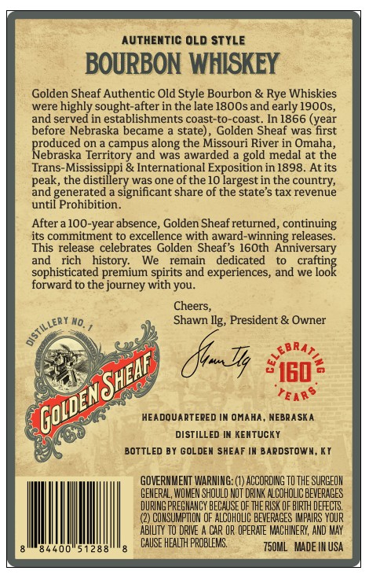
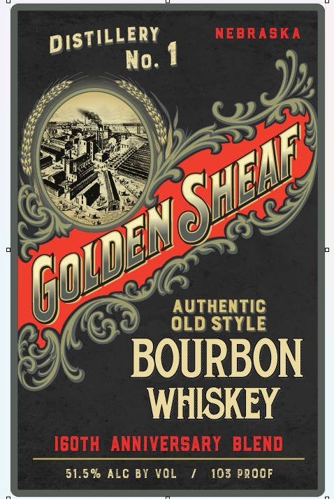
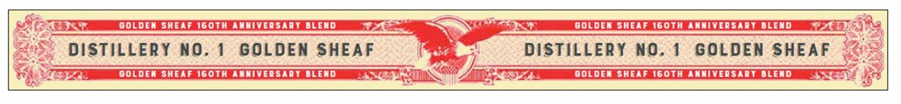

# TTB COLA Label Images - TTBID 26204001000377

**Brand Name:** GOLDEN SHEAF

**Issue Date:** 07/28/2026

**Origin Code:** 22

**Product Class/Type:** 141

**Source:** [TTB Public COLA Registry](https://ttbonline.gov/colasonline/viewColaDetails.do?action=publicFormDisplay&ttbid=26204001000377)

## Label Images

### Back Label

### Front Label

### Label 3

## Extracted Label Text

*Text extracted via OCR - may contain errors*

**Detected Proof:** 103

### Back Label

AUthentiC OLd STYLE
BOURBON WHISKEY
Golden Sheaf Authentic Old Style Bourbon & Rye Whiskies
were highly
sought-after in the late 180Osand early 1900s,
and served in establishments coast-to-coast. In 1866 (year
before Nebraska
became
state) , Golden Sheaf was first
Reduced &
campus along the Missouri River in Omaha,
Territory and was awarded
gold medal at the
[rans
& International Exposition in 1898_
At its
peak
thesdissilery
the
was one of
'the 10 largest in the
and generated
significant share of the state's tax revenue
until Prohibition_
Aftera 10O-year absence, Golden Sheaf returned, continuing
its commitment t0 excellence with award-winning releases
This release
celebrates
Golden Sheaf's 16Oth Anniversary
and
rich
history_
We
remain
dedicated
crefoog
sophisticated premium spirits and experiences; and we
forward to the journey with you:
Cheers,
Shawn Ilg,
President & Owner
BRA
Xx
IG0
HEADOUARTERED IN OMAHA, NEBRA SKA
DISTILLED IN KEHTUCKY
BOTTLED By GoLdEM SHEAF IK BARDSTOWM_
GOVERMMENT WARNING: (€) ACCORDING TO THE SURGEOH
GEHERAL, WOMEN SHOULD NOT DRINK ALCOHOLIC BEVERAGES
DURING PREGHAHCY BECAUSE OF THE RISK QF BIRTH DEFECT
(2) COHSUMPTON OF ALCOHOUC BEVERAGES IMPAIPS YOUR
ABLLTY TO DRIVE
CAR OR OPERATE MACHINEFY, AND MAY
84400"
51288
CAUSE HEALTH PROBLEMS,
750ML   Made IM USA
country;
OlSTillery,
Tq
YSHEAF ,
GoLDENc

### Front Label

NEBRASKA
No. 1
AUTHENTIC
OLD STYLE
BOURBON
WHISKEY
I60TH  ANNIVERSARY   BLEND
51.5 % ALc BI VOL
103 PRoOF
DISTILLERY
SHENE
Goiden

### Label 3

GOLDEMSHEAF I60th AMMIVERSADY DLENd
GOL DEM SHEAF I60th AMMIVERSTDT DLEND
DISTILLERY NO. 1
GOLDEN SHEAF
DISTILLERY nO. 1
GOLDEN SHEAF
DOLDE SHEE T60T AWMIVEDSRYDLED
DOLDE SHEE T60Th AMIVERSRYDLITD
