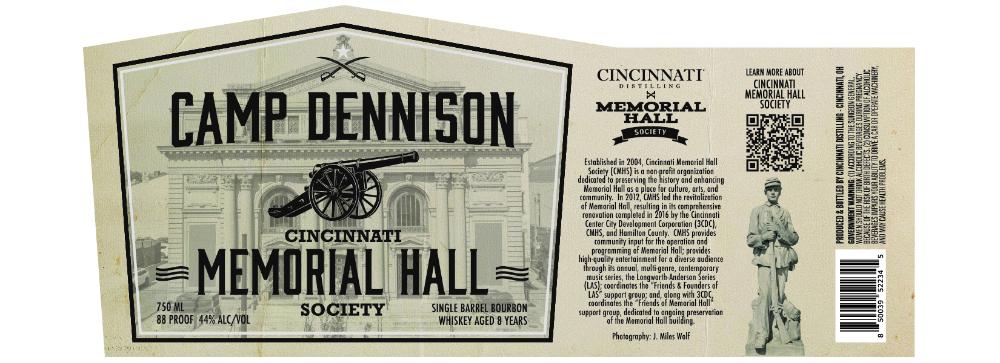

# TTB COLA Label Images - TTBID 26204001000435

**Brand Name:** CAMP DENNISON MEMORIAL HALL

**Issue Date:** 07/28/2026

**Origin Code:** 09

**Product Class/Type:** 141

**Source:** [TTB Public COLA Registry](https://ttbonline.gov/colasonline/viewColaDetails.do?action=publicFormDisplay&ttbid=26204001000435)

## Label Images

### Label 1

## Extracted Label Text

*Text extracted via OCR - may contain errors*

### Label 1

CINCINNATI

Sores)
MEMORIAL
HALL

mR,

Established in 2004, Cincinnati Memarial Hall
Sect (CHS isa nan- pf erganzatin
dedicated to preserving the history and enhancing
Memorial Hall as a place for culture, ats, ond
community. In 2012, CHHS led the revita
cof Memorial Holl, resulting in its comprehensive
renovation completed in 2016 by the Cincinnati
Center City Development Corporation (3€DC),
CNS, and Hamilton County. MHS provides

input for the operation and
programming of Memorial Hall; provides
bighqulty enertnmen for adhere avince
annual, multi-genre, contemporary
m ‘Anderson Series
(LAS); coordinates the “Friends & Founders of
AS? support group; and, long with 3C0C,
cardinals he Trends of Manor Hl
support group, dedicated to ongoing preservation

en he Memoria all bila,

Photography: J Miles Wolf

‘LEARN MORE ABOUT.
CINCINNATI
MEMORIAL HALL
SOCIETY
a0}

bi

RAL,
OUI BEVERAGES DURING PREGNANCY

‘BECAUSE OF THE FISK OF BIRTH DEFECTS. (2) CONSUMPTION OF ALCOHOUC
BEVERAGES IMPAIRS YOUR ABILITY TO ORIVE CAR OR OPERATE MACHINERY,

ACCORDING TO THE SURGE
AND MAY CAUSE HEALTH PROBLEMS,

‘PRODUCED & BOTTLED BY CINCINNATI DISTILLING

‘WOMEX SHOULD NOT DRINK)
