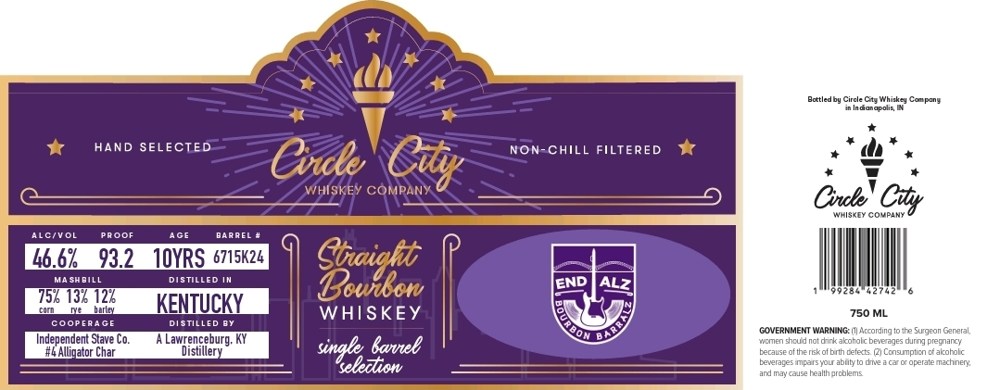

# TTB COLA Label Images - TTBID 26204001000472

**Brand Name:** CIRCLE CITY WHISKEY COMPANY

**Issue Date:** 07/28/2026

**Origin Code:** 19

**Product Class/Type:** 101

**Source:** [TTB Public COLA Registry](https://ttbonline.gov/colasonline/viewColaDetails.do?action=publicFormDisplay&ttbid=26204001000472)

## Label Images

### Label 1

## Extracted Label Text

*Text extracted via OCR - may contain errors*

### Label 1

Bottedou Cnc
Ctehiekeu
conpone
IneIn dlanac OMs
HAND SELECTED
Non-CHILL FILTERED
Cvdle
WHISKEY COMPAN
Cnl coCity
Whisk[Y COUPANT
ALCivo
PAooF
AGE
BAAAEL
46.62
93.2
1OYRS 6715K24
MA SH BILL
DISTILLED
Gaidii
END
757 132 122
KENTUCKY
hanay
WHISKEY
750 ML
Coop
Disted
COVERNMENT WARNING: (I| According to tte
Garara
Independent Stave Co.
Lawrenceburg; KY
Banel
YicMen scuo
dirk akoholcbeveraes_
durn] pregnarcy
# EAlliqator Char
Distillery
singeledion
Eecalse of the rkof brth celeds
Lcnsumplicn c-aizorolc
LeveragesinparsYOLr ablity t0 dT2 2 car
operale Machneri
ardTagsa tealh orcblems
Cty
ALZ
Iaa
cugeo
