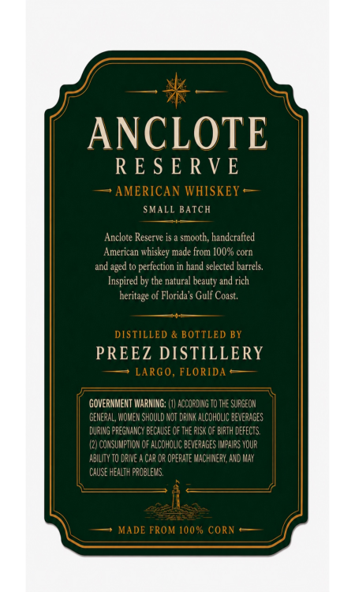
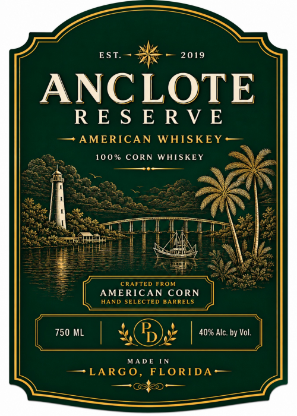

# TTB COLA Label Images - TTBID 26204001000514

**Brand Name:** ANCLOTE RESERVE

**Issue Date:** 08/10/2026

**Origin Code:** 16

**Product Class/Type:** 143

**Source:** [TTB Public COLA Registry](https://ttbonline.gov/colasonline/viewColaDetails.do?action=publicFormDisplay&ttbid=26204001000514)

## Label Images

### Back Label

### Front Label

## Extracted Label Text

*Text extracted via OCR - may contain errors*

### Back Label

ANCLOTE
RE $ E RV E
AMERICAN WHISKEY
SMALL Batch
Anclote Reserve is
Smooth; handcralted
American whiskev made from 10US corn
and aged to perfection in hand selected barrels
Inspired by the natural beauty and rich
heritage of Florida $ Gulf Coast.
DISTILLED
BOTTLED BY
PREEZ DISTILLERY
LARGO , FLORIDA
GOVERNMEHT WARNING:
ACCORDUYG To THE SURGEON
GEMERAL, WOMEM Should NOT DRUKK ALCoHOLIC beverages
DRING PREGMANCY BEcalse CF THE PISk Q= EMFTh DEfects
CONSUMPTUOH CF PLCOHOLIC bevepages IMPaIPS YOUR
AbIY TO DRnE
ChR @F OPERATE MACHINEDY A"D MaX
CAUSE HEALTH problevs.
MADE FROM 100% CORN

### Front Label

est. He 2019
ANCLOTE
(

— AMERICAN WHISKEY —
rita, 100% CORN WHISKEY 4
g ic ae oie
ee in, es z pees f
ae ate = ite |e
chee LL A Lt oe eed aoe
ate | | aaa Oi Pi

gees May WV

See a

==> 2 crartep trom We

HAND SELECTED BARRELS

7 a

| 750 ML 4 | 40% ne by Vol

l J

MADE IN
— LARGO, FLORIDA—
— aston —
