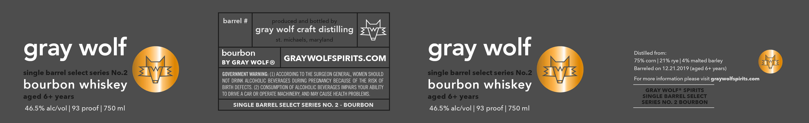

# TTB COLA Label Images - TTBID 26204001000547

**Brand Name:** GRAY WOLF

**Issue Date:** 07/28/2026

**Origin Code:** 25

**Product Class/Type:** 141

**Source:** [TTB Public COLA Registry](https://ttbonline.gov/colasonline/viewColaDetails.do?action=publicFormDisplay&ttbid=26204001000547)

## Label Images

### Label 1

## Extracted Label Text

*Text extracted via OCR - may contain errors*

**Detected Proof:** 93

### Label 1

ume gray wolf craft distilling paved

bourbon

Distilled from:

gray wolf

GRAY WOLFSPIRITS.COM

gray wolf

75% corn | 21% rye | 4% malted barley

BY GRAY WOLF ®

yf

Barreled on 12.21.2019 (aged 6+ years)

GOVERNMENT WARNING: (1) ACCORDING TO THE SURGEON GENERAL, WOMEN SHOULD

NOT DRINK ALCOHOLIC BEVERAGES DURING PREGNANCY BECAUSE OF THE RISK OF

For more information please visit graywolfspirits.com

BIRTH DEFECTS. (2) CONSUMPTION OF ALCOHOLIC BEVERAGES IMPAIRS YOUR ABILITY

bourbon whiskey

bourbon whiskey

TO DRIVE A CAR OR OPERATE MACHINERY, AND MAY CAUSE HEALTH PROBLEMS.

SINGLE BARREL SELECT SERIES NO. 2 - BOURBON

46.5% alc/vol | 93 proof | 750 ml

46.5% alc/vol | 93 proof | 750 ml
