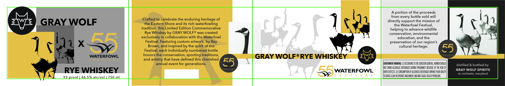

# TTB COLA Label Images - TTBID 26204001000551

**Brand Name:** GRAY WOLF

**Issue Date:** 07/28/2026

**Origin Code:** 25

**Product Class/Type:** 142

**Source:** [TTB Public COLA Registry](https://ttbonline.gov/colasonline/viewColaDetails.do?action=publicFormDisplay&ttbid=26204001000551)

## Label Images

### Label 1

## Extracted Label Text

*Text extracted via OCR - may contain errors*

**Detected Proof:** 93

### Label 1

A portion of the proceeds

from every bottle sold will

Crafted to celebrate the enduring heritage of

directly support the mission of

AV om

OLF

the Eastern Shore and its rich waterfowling

the Waterfowl Festival

tradition, this Limited Edition Commemorative

=

1%

helping to advance wildlife

lis

Rye Whiskey by GRAY WOLF® was created

conservation, environmental

e

exclusively in collaboration with the Waterfowl

-

education, and the

ue

Festival. Featuring custom artwork, by Ray

preservation of our region’s

Brown, and inspired by the spirit of the

cultural heritage

th

Festival, each individually numbered bottle

Festiy

WATERFOWL

honors the conservation, sporting traditions

GRAY WOLF®RYE WHISKEY

and artistry that have defined this cherished

annual event for generations

GOVERNMENT WARNING: (1) ACCORDING TO THE SURGEON GENERAL, WOMEN SHOULD

NOT DRINK ALCOHOLIC BEVERAGES DURING PREGNANCY BECAUSE OF THE RISK OF

distilled & bottled by

GRAY WOLF SPIRITS

RYE WHISKEY

BIRTH DEFECTS. (2) CONSUMPTION OF ALCOHOLIC BEVERAGES IMPAIRS YOUR ABILITY

st. michaels, maryland

3 proof | 46.5% alc/vol

750 ml

Ss WATERFOWL

TO DRIVEA CAR OR OPERATE MACHINERY, AND MAY CAUSE HEALTH PROBLEMS.
