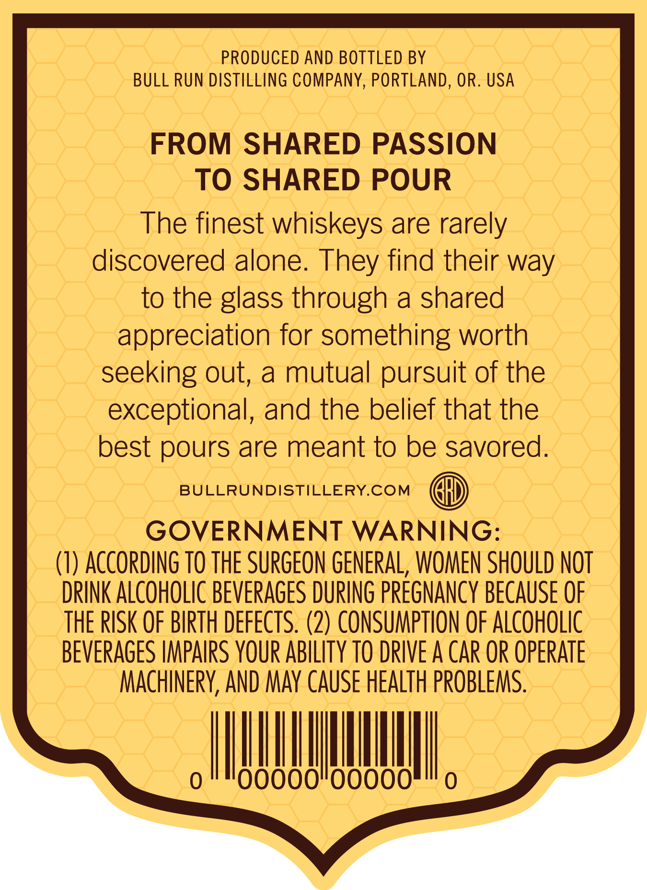
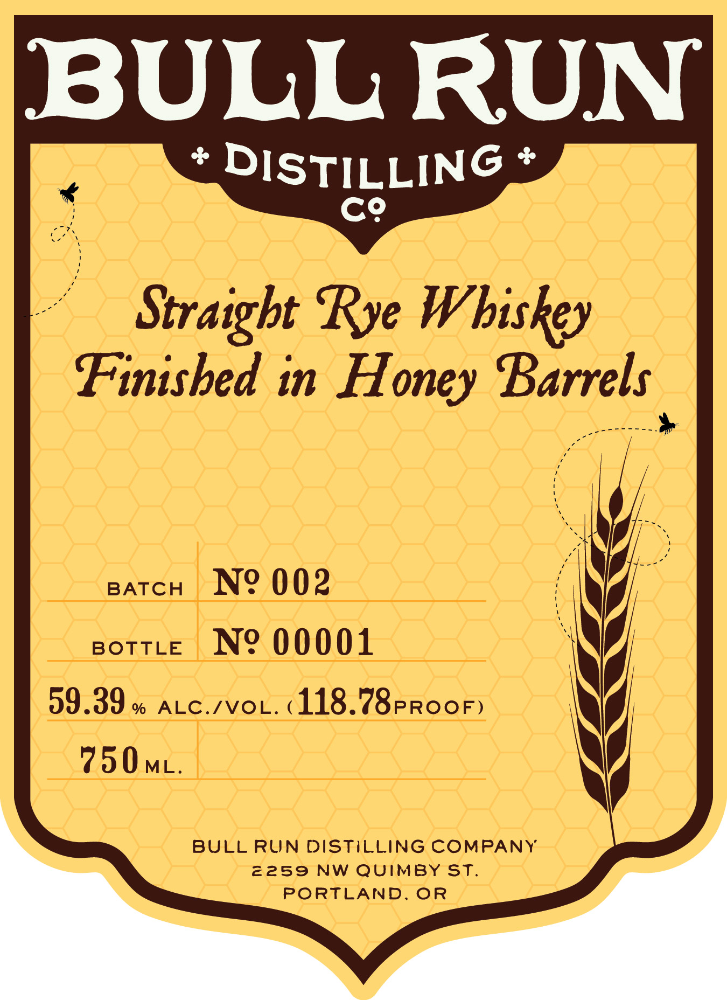
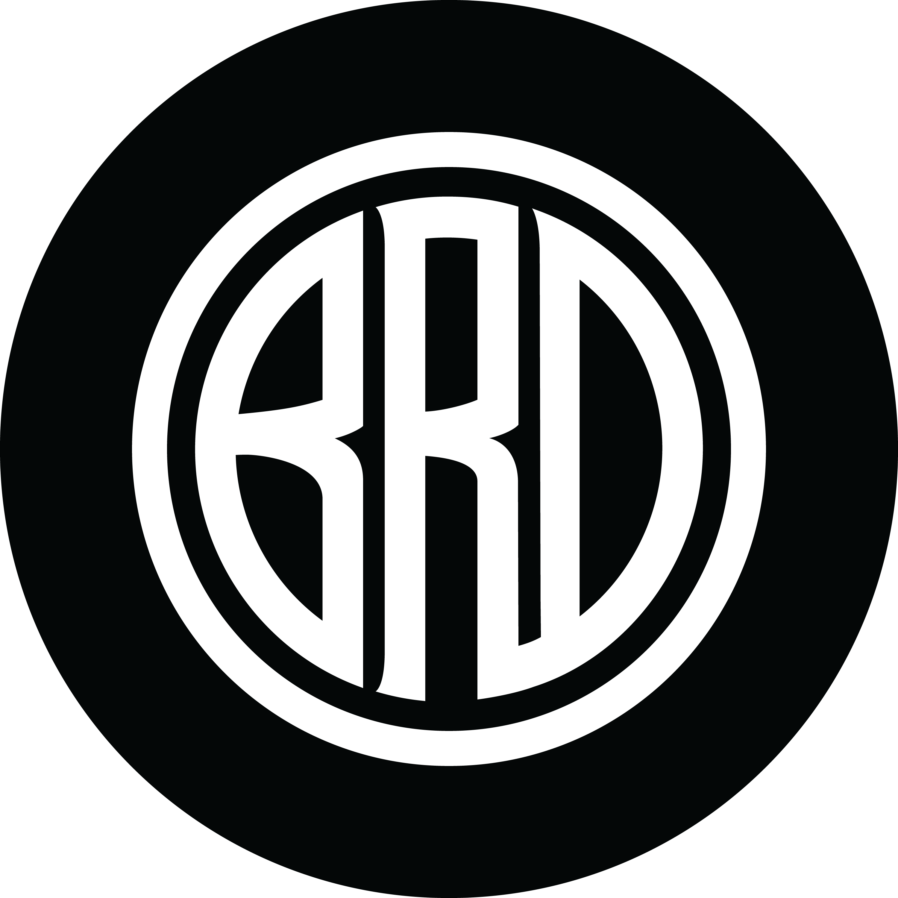

# TTB COLA Label Images - TTBID 26204001000612

**Brand Name:** WESTMORELAND LIQUOR

**Fanciful Name:** BULL RUN DISTILLING CO.

**Issue Date:** 07/30/2026

**Origin Code:** 38

**Product Class/Type:** 102

**Source:** [TTB Public COLA Registry](https://ttbonline.gov/colasonline/viewColaDetails.do?action=publicFormDisplay&ttbid=26204001000612)

## Label Images

### Back Label

### Front Label

### Label 1

### Label 4

## Extracted Label Text

*Text extracted via OCR - may contain errors*

*2 image(s) excluded: text did not meet readability threshold*

**Detected Proof:** 118.8

### Back Label

PRODUCED AND BOTTLED BY
BULL RUN DISTILLING COMPANY, PORTLAND, OR. USA
FROM SHARED PASSION
TO SHARED POUR
The finest whiskeys are rarely
discovered alone. They find their way
to the glass through a shared
appreciation for something worth
seeking out, a mutual pursuit of the
exceptional, and the belief that the
best pours are meant to be savored.
BULLRUNDISTILLERY.COM
GOVERNMENT WARNING:

(1) ACCORDING TO THE SURGEON GENERAL, WOMEN SHOULD NOT
DRINK ALCOHOLIC BEVERAGES DURING PREGNANCY BECAUSE OF
THE RISK OF BIRTH DEFECTS. (2) CONSUMPTION OF ALCOHOLIC
BEVERAGES IMPAIRS YOUR ABILITY T0 DRIVE A CAR OR OPERATE

MACHINERY, AND MAY CAUSE HEALTH PROBLEMS.
~ SELLE ~

### Front Label

BULL RUN
DISTILLING
C9
Straigbt Rye Wbiskey
Finisbed in Honey Barrels
BATCH
No 002
BOTTLE
No 00001
59.39
%
ALC.IVOL.
118.78pRooF)
750 ML;
BULL RUN DISTILLING COMPANY
2259 NW Quimby ST.
PORTLAND_
OR
