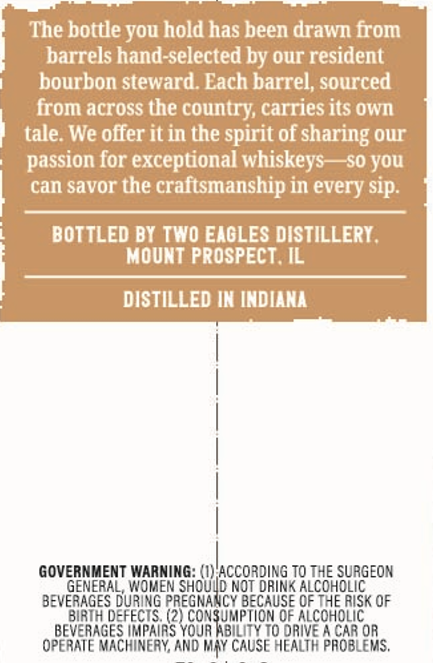
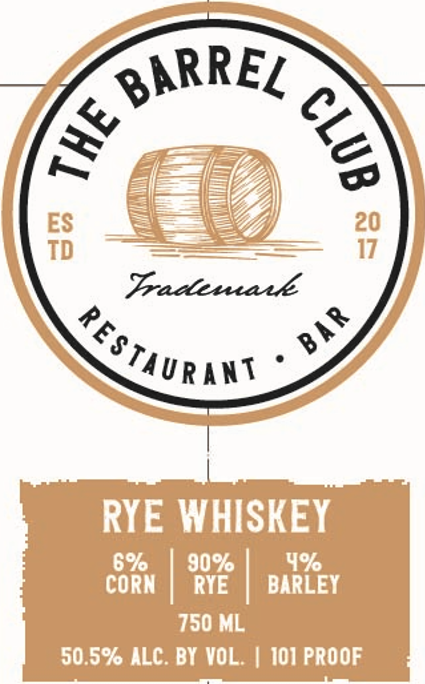

# TTB COLA Label Images - TTBID 26204001000636

**Brand Name:** THE BARREL CLUB

**Issue Date:** 07/29/2026

**Origin Code:** 04

**Product Class/Type:** 142

**Source:** [TTB Public COLA Registry](https://ttbonline.gov/colasonline/viewColaDetails.do?action=publicFormDisplay&ttbid=26204001000636)

## Label Images

### Back Label

### Front Label

## Extracted Label Text

*Text extracted via OCR - may contain errors*

**Detected Proof:** 90

### Back Label

The bottle you hold has been drawn
barrels hand-selected by our resident
bourbon steward Lach barrel, sourced
across the country; carries its Own
tale; We offer it in the spirit of sharing our
passion for exceptional whiskeys
S0 you
can savor the craftsmanship in every sip:
BOTTLED BY TWO EXGLES DISTILLERY ,
MOUNt PROSPECT IL
DISTILLED IN INDIANA
GOVERNMENT WARNING:
NGoUBCcORDHNG TO COFgLRGEon
GENERAL, WOMEN
NOT DRINK
BEVERAGES DURING PREGNANCY
GoGMpionge
OF TNE RISk OF
RIH deffcIS (2
OF ALCOHOLIC
BEVERAGES UPAIRS YOJRIBILn to
CaR Or
Operate Machinery ANd May CAUSe
O1RLTF ProbLOrs.
from
from

### Front Label

BARREL
ES
20
TD
17
Tradleua e
RYE WHISKEY
696
90%
4%
CORN
RYE
BARLEY
750 ML
50,5% ALC. BY VOL ;
101 PROOF
8
4
BA R
FestaUrans
