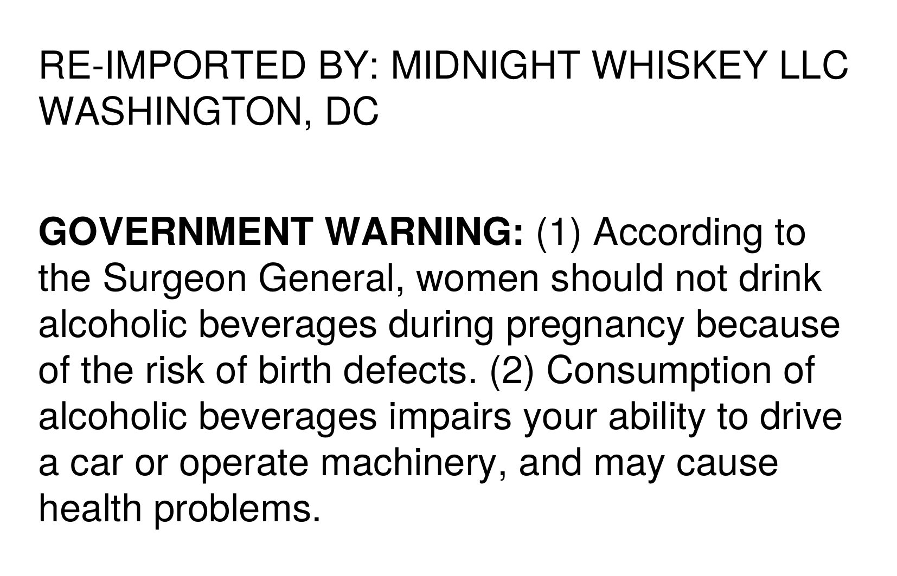

# TTB COLA Label Images - TTBID 26204001000824

**Brand Name:** BLANTON'S

**Issue Date:** 08/04/2026

**Origin Code:** 4K

**Product Class/Type:** 101

**Source:** [TTB Public COLA Registry](https://ttbonline.gov/colasonline/viewColaDetails.do?action=publicFormDisplay&ttbid=26204001000824)

## Label Images

### Back Label

## Extracted Label Text

*Text extracted via OCR - may contain errors*

### Back Label

RE-IMPORTED BY: MIDNIGHT WHISKEY LLC

WASHINGTON, DC

GOVERNMENT WARNING: (1) According to

the Surgeon General, women should not drink

alcoholic beverages during pregnancy because

of the risk of birth defects. (2) Consumption of

alcoholic beverages impairs your ability to drive

a car or operate machinery, and may cause

health problems.
