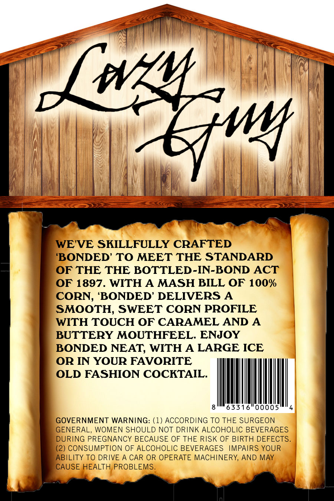
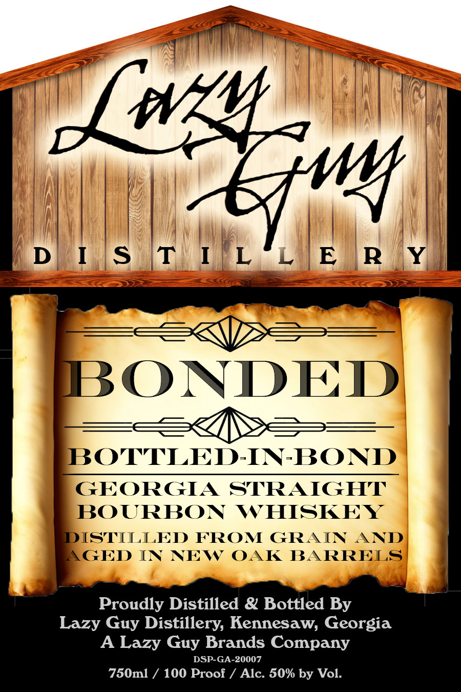

# TTB COLA Label Images - TTBID 26204001000833

**Brand Name:** BONDED

**Issue Date:** 07/30/2026

**Origin Code:** 08

**Product Class/Type:** 111

**Source:** [TTB Public COLA Registry](https://ttbonline.gov/colasonline/viewColaDetails.do?action=publicFormDisplay&ttbid=26204001000833)

## Label Images

### Back Label

### Front Label

## Extracted Label Text

*Text extracted via OCR - may contain errors*

**Detected Proof:** 100

### Back Label

Jwlm
WE'VE SKILLFULLY CRAFTED
'BONDED' TO MEET THE STANDARD
OF THE THE BOTTLED-IN-BOND ACT
OF 1897 . WITH A
MASH BILL OF 100%
CORN, 'BONDED' DELIVERS A
SMOOTH;, SWEET CORN PROFILE
WITH TOUCH OF CARAMEL AND A
BUTTERY MOUTHFEEL. ENJOY
BONDED NEAT; WITH A LARGE ICE
OR IN YOUR FAVORITE
OLD FASHION COCKTAIL.
63316
00005
GOVERNMENT WARNING: (1) ACCORDING TO THE SURGEON
GENERAL, WOMEN SHOULD NOT DRINK ALCOHOLIC BEVERAGES
DURING PREGNANCY BECAUSE OF THE RISK OF BIRTH DEFECTS
(2) CONSUMPTION OF ALCOHOLIC BEVERAGES
IMPAIRS YOUR
ABILITY TO DRIVE A CAR OR OPERATE MACHINERY, AND MAY
CAUSE HEALTH PROBLEMS.
Yw

### Front Label

Jwlm
D ls tIL'L E RY
BONDED
3E
BOTTLED-IN-BOND
GEORGIA
STRAIGHT
BOURBON
WHISKEY
DISTILLED
FROM GRAIN
AND
GED IN NEW OAK
BARRELS
Proudly Distilled & Bottled By
Lazy
Distillery, Kennesaw; Georgia
A Lazy
Brands Company
DSP GA-20007
750ml
100 Proof
Alc: 50% by Vol:
'w
Guy
Guy
