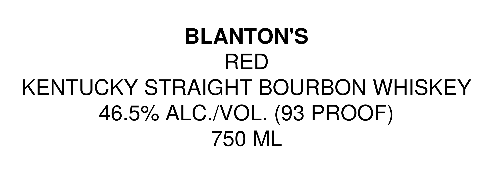
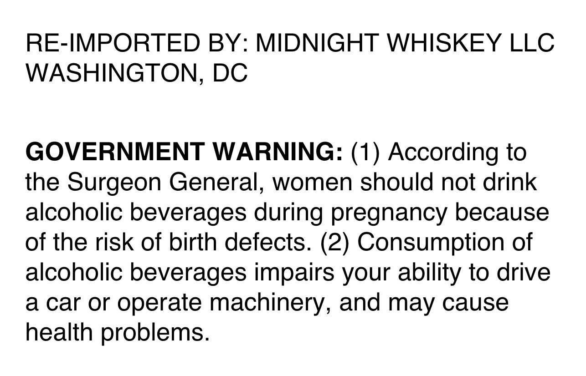

# TTB COLA Label Images - TTBID 26204001000853

**Brand Name:** BLANTON'S

**Issue Date:** 08/04/2026

**Origin Code:** 4K

**Product Class/Type:** 101

**Source:** [TTB Public COLA Registry](https://ttbonline.gov/colasonline/viewColaDetails.do?action=publicFormDisplay&ttbid=26204001000853)

## Label Images

### Label 1

### Label 2

## Extracted Label Text

*Text extracted via OCR - may contain errors*

**Detected Proof:** 93

### Label 1

BLANTON'S
RED
KENTUCKY STRAIGHT BOURBON WHISKEY
46.5%/ ALC NOL. (93 PROOF)
750 ML

### Label 2

RE-IMPORTED BY: MIDNIGHT WHISKEY LLC
WASHINGTON, DC
GOVERNMENT WARNING: (1) According to
the Surgeon General,;
women should not drink
alcoholic beverages during pregnancy because
of the risk of birth defects. (2) Consumption of
alcoholic beverages impairs your ability to drive
a car Or
operate machinery, and may cause
health problems
