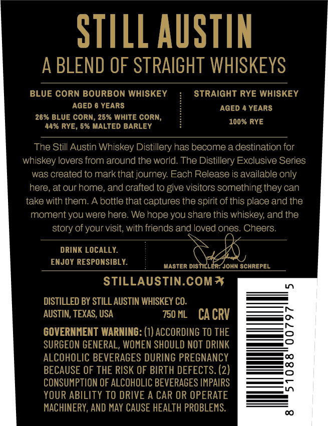
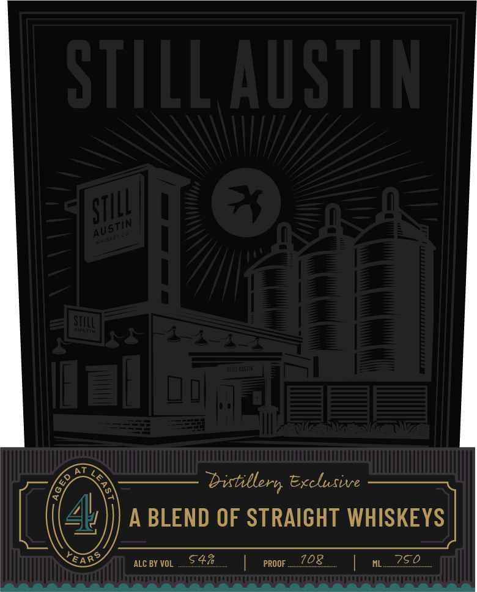
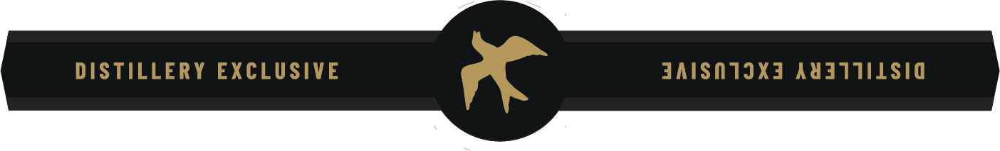

# TTB COLA Label Images - TTBID 26205001000117

**Brand Name:** STILL AUSTIN

**Fanciful Name:** DISTILLERY EXCLUSIVE

**Issue Date:** 07/29/2026

**Origin Code:** 44

**Product Class/Type:** 120

**Source:** [TTB Public COLA Registry](https://ttbonline.gov/colasonline/viewColaDetails.do?action=publicFormDisplay&ttbid=26205001000117)

## Label Images

### Back Label

### Front Label

### Label 3

## Extracted Label Text

*Text extracted via OCR - may contain errors*

*1 image(s) excluded: text did not meet readability threshold*

**Detected Age:** 4 Years

### Back Label

STILL AUSTIN
A BLEND OF STRAIGHT WHISKEYS

STRAIGHT RYE WHISKEY
AGED 4 YEARS
100% RYE

BLUE CORN BOURBON WHISKEY
AGED 6 YEARS

26% BLUE CORN, 26% WHITE CORN,
44% RYE, 6% MALTED BARLEY

The Still Austin Whiskey Distillery has become a destination for
whiskey lovers from around the world. The Distillery Exclusive Series
was created to mark that journey. Each Release is available only
here, at our home, and crafted to give visitors something they can
take with them. A bottle that captures the spirit of this place and the
moment you were here. We hope you share this whiskey, and the
story of your visit, with friends and loved ones: Cheers.

DRINK LOCALLY. Sey
ENJOY RESPONSIBLY. siaaten bestieueR Goin somniPL

STILLAUSTIN.COM%

DISTILLED BY STILL AUSTIN WHISKEY CO.
AUSTIN, TEXAS, USA rome ~CACRV

GOVERNMENT WARNING: (1) ACCORDING TO THE
SURGEON GENERAL, WOMEN SHOULD NOT DRINK
ALCOHOLIC BEVERAGES DURING PREGNANCY
BECAUSE OF THE RISK OF BIRTH DEFECTS. (2)
CONSUMPTION OF ALCOHOLIC BEVERAGES IMPAIRS
YOUR ABILITY TO DRIVE A CAR OR OPERATE
MACHINERY, AND MAY CAUSE HEALTH PROBLEMS.

### Front Label

STILL AusTIN
.^
bitillern Exclusive
A
BLEND OF STRAIGHT WHISKEYS
ALC BY VOL
547
PROOF
7o8
750
STILL ,
AUSTin

STL
FaRS
