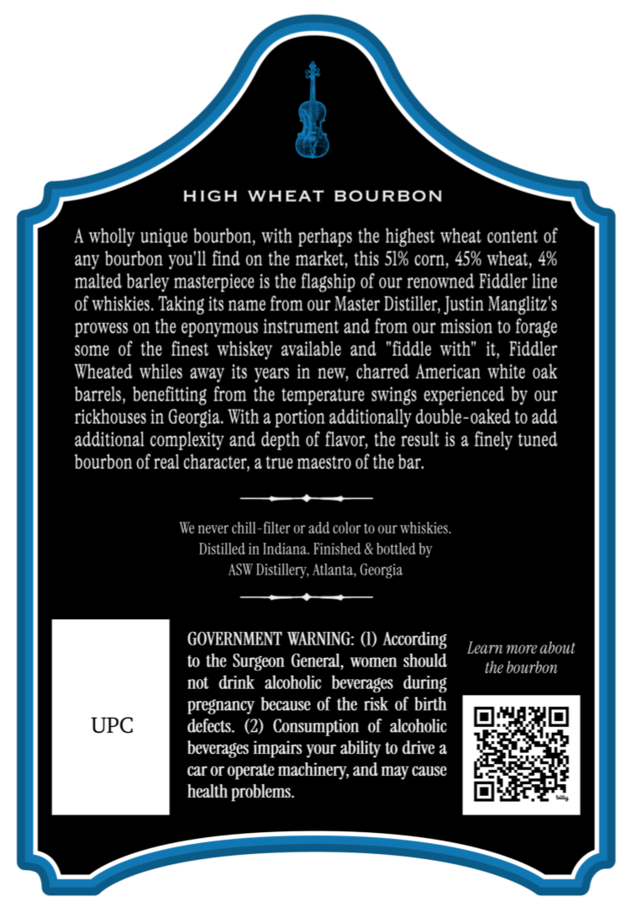
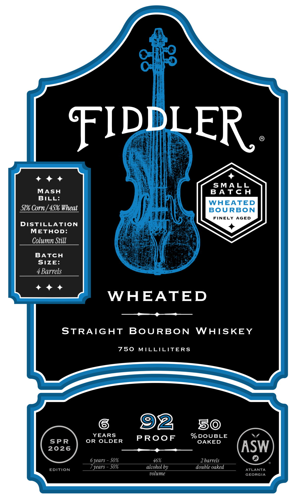

# TTB COLA Label Images - TTBID 26205001000149

**Brand Name:** FIDDLER

**Fanciful Name:** WHEATED

**Issue Date:** 07/29/2026

**Origin Code:** 08

**Product Class/Type:** 101

**Source:** [TTB Public COLA Registry](https://ttbonline.gov/colasonline/viewColaDetails.do?action=publicFormDisplay&ttbid=26205001000149)

## Label Images

### Back Label

### Front Label

## Extracted Label Text

*Text extracted via OCR - may contain errors*

**Detected Proof:** 100
**Detected Age:** 50 Years

### Back Label

AIGH
WAEAT
BOURBON
A wholly unique bourbon, with perhaps the highest wheat content of
any bourbon you'Il find on the market, this 51% corn, 45% wheat, 4%
malted barley masterpiece is the flagship of our renowned Fiddler line
of whiskies. Taking its name from our Master Distiller, Justin Manglitz $
prowess on the eponymous instrument and from our mission to forage
some of the finest  whiskey  available and "fiddle with" it, Fiddler
Wheated whiles away its years in new, charred American white oak
barrels, benefitting from the temperature
experienced by our
rickhouses in Georgia. With a portion additionally double-oaked to add
additional complexity and depth of flavor; the result is a finely tuned
bourbon of real character; a true maestro of the bar:
We never chill-filter or add color t0 our whiskies:
Distilled in Indiana. Finished & bottled by
ASW Distillery, Atlanta, Georgia
GOVERNMENT WARNING:
According
Learn more about
to the
Surgeon General , women should
the bourbon
nol
drink  alcoholic   beverages   during
pregnancy because of the risk of birth
UPC
defects.
Consumption   of   alcoholic
beverages impairs your ability to drive a
car Or operate machinery, and may cause
health problems
swings

### Front Label

FIDDLER
SMALL
MASH
B A T c H
BILL:
WAEATED
51% Corn | 45% Wheat
BoURBON
FINELY AGED
DISTILLATION
METHOD:
Column Still
BATCH
SIZE:
4 Barrels
WHEATED
STRAIGHT
BoURBON
WAISKEY
750
MILLILITERS
92
50
YEARS
%DOUBLE
SPR
OR
OLDER
PRooF
OAKED
2026
ASW
6 years
50%
46%
2 barrels
years
50%
alcohol by
double oaked
EDITION
ATLANTA
volume
GEORGIA
