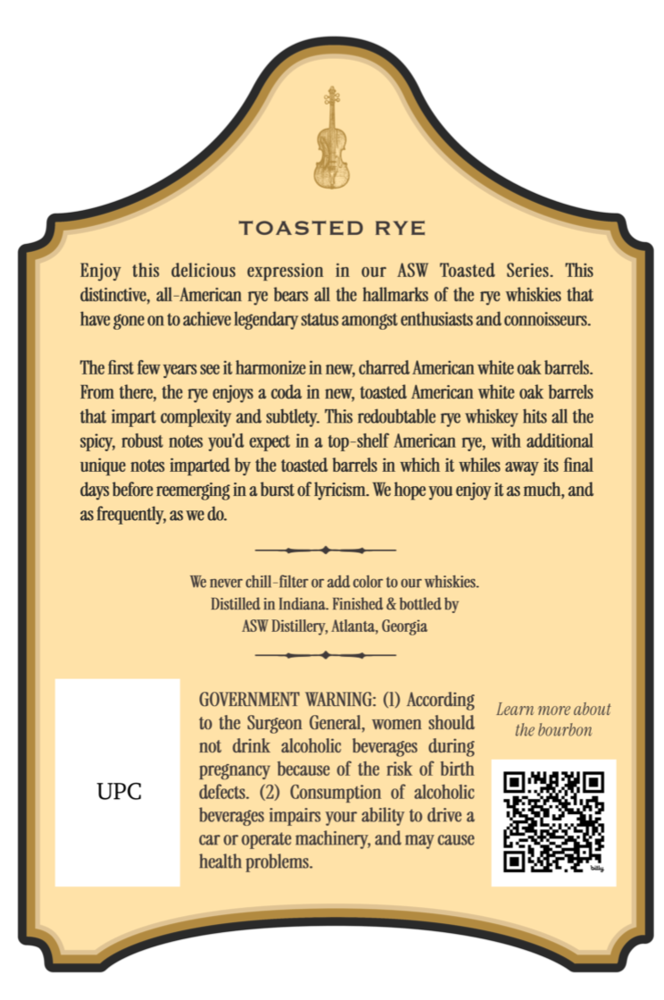
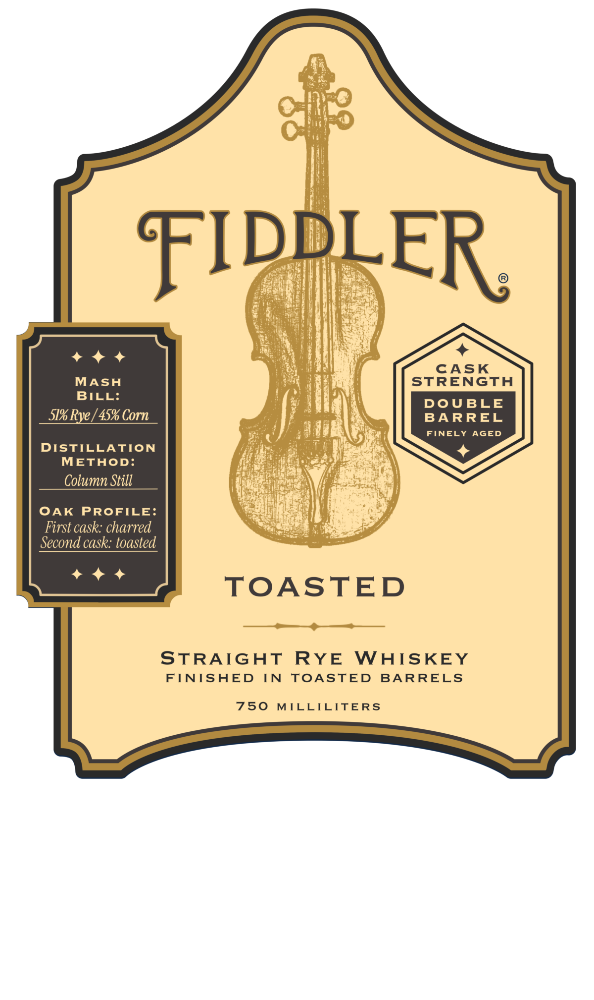
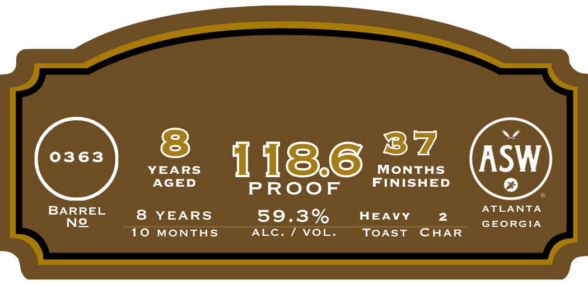

# TTB COLA Label Images - TTBID 26205001000157

**Brand Name:** FIDDLER

**Fanciful Name:** TOASTED

**Issue Date:** 07/29/2026

**Origin Code:** 08

**Product Class/Type:** 102

**Source:** [TTB Public COLA Registry](https://ttbonline.gov/colasonline/viewColaDetails.do?action=publicFormDisplay&ttbid=26205001000157)

## Label Images

### Back Label

### Front Label

### Label 2

## Extracted Label Text

*Text extracted via OCR - may contain errors*

**Detected Proof:** 118.6
**Detected Age:** 8 Years

### Back Label

TOASTED
RYE
Enjoy
this   delicious   expression   in
our
ASW
Toasted
Series.
This
distinctive , all-American rye bears all the hallmarks of the rye whiskies that
have gone on to achieve legendary status amongst enthusiasts and connoisseurs
The first few years see it harmonize in new, charred American white oak barrels
From there; the rye enjoys a coda in new; toasted American white oak barrels
that impart complexity and subtlety: This redoubtable rye whiskey hits all the
spicy; robust notes you'd expect in a top-shelf American rye, with additional
unique notes imparted by the toasted barrels in which it whiles away its final
days before reemerging in a burst of lyricism. Wehope you enjoy itas much; and
as frequently; as we do:
We never chill-filter or add color to our whiskies
Distilled in Indiana. Finished & bottled by
ASW Distillery; Atlanta, Georgia
GOVERNMENT WARNING: (I) According
Learn more about
to the
Surgeon General, women should
the bourbon
not   drink   alcoholic   beverages   during
pregnancy because of the risk of birth
UPC
defects.
Consumption   of   alcoholic
beverages impairs your ability to drive a
car or operate
machinery; and
cause
health problems:
may

### Front Label

FIDDLER
CASK
MASH
STRENGTH
BILL:
DoUBLE
51% Rye ] 45% Corn
BARREL
FINELY
AGED
DISTILLATION
METHOD:
Column Still
OAK
PROFILE:
First cask: charred
Second cask: toasted
TOASTED
STRAIGHT
RYE
WAISKEY
FTNISHED
IN
TOASTED
BARRELS
750
MILLICITERS

### Label 2

8
37
0363
YEARS
1186
MoNTHS
ASW
AGED
FINISHED
PRooF
BARREL
ATLANTA
8
YEARS
59.3%
HEAVY
2
No
GEORGIA
10
MONTHS
ALC: / VOL
TOAST
CHAR
