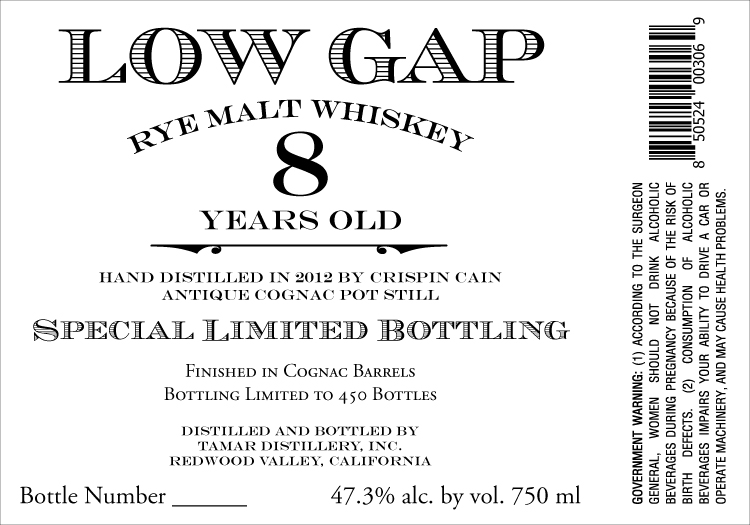

# TTB COLA Label Images - TTBID 26205001000169

**Brand Name:** LOW GAP

**Issue Date:** 07/30/2026

**Origin Code:** 01

**Product Class/Type:** 118

**Source:** [TTB Public COLA Registry](https://ttbonline.gov/colasonline/viewColaDetails.do?action=publicFormDisplay&ttbid=26205001000169)

## Label Images

### Label 1

## Extracted Label Text

*Text extracted via OCR - may contain errors*

**Detected Proof:** 94.6

### Label 1

ILOVWY GAP

oe MALT WHISK,

YEARS OLD

HAND DISTILLED
ANTIQUE COC

SPECIAL LIMITED BOTTLING

FintsHep 1N Cocnac BarreLs
Borruing Limirep To 450 Borrtes

012 BY CRISPIN CAIN
C POT STILL,

ILLED AND BO!
TAMAR DISTI
REDWOOD VALLEY,

Bottle Number 47.3% alc. by vol. 750 ml

cy

)) CONSUMPTION OF ALCOHOLIC

WOMEN SHOULD NOT DRINK ALCOHOLIC

BEVERAGES DURING PREGNANCY BECAUSE OF THE RISK OF

GOVERNMENT WARNING: (1) ACCORDING TO THE SURGEON
BIRTH DEFECTS.

BEVERAGES IMPAIRS YOUR ABILITY TO DRIVE A CAR OR
OPERATE MACHINERY, AND MAY CAUSE HEALTH PROBLEMS,

GENERAL,
