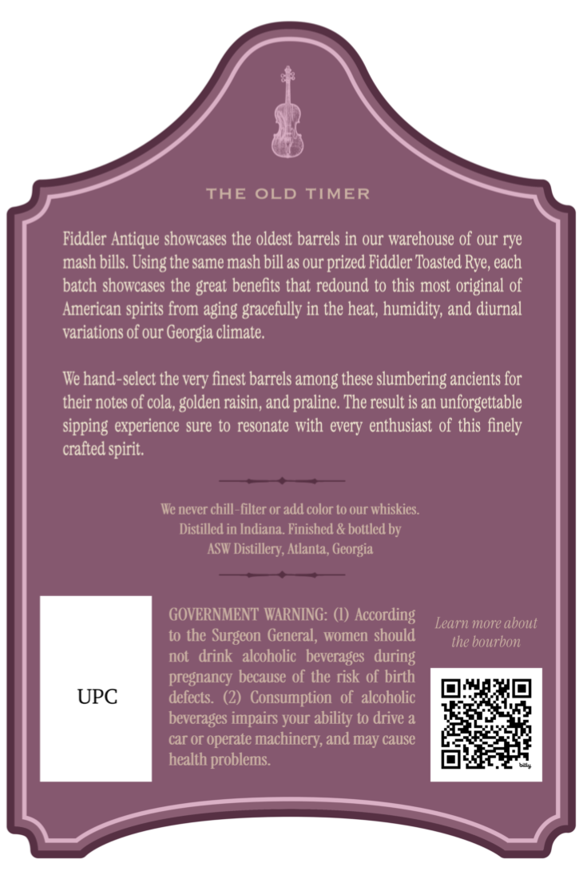
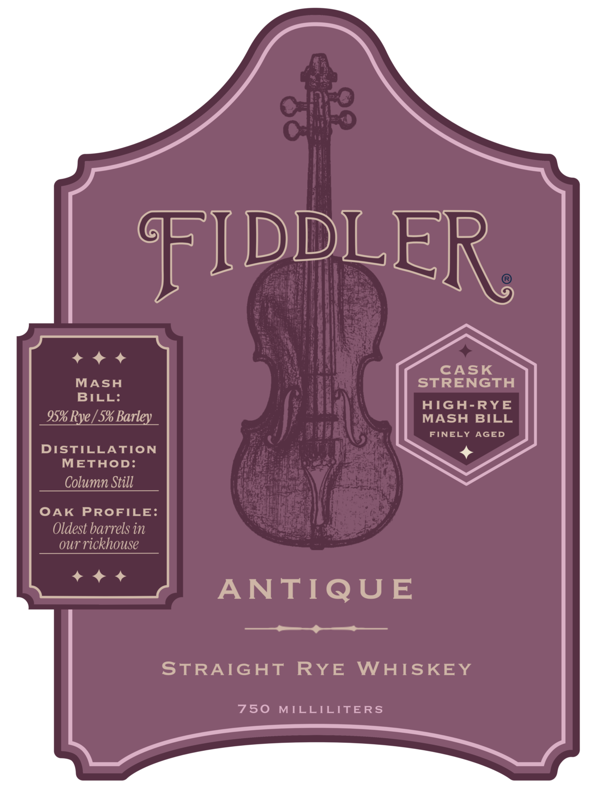

# TTB COLA Label Images - TTBID 26205001000183

**Brand Name:** FIDDLER

**Fanciful Name:** ANTIQUE

**Issue Date:** 07/29/2026

**Origin Code:** 08

**Product Class/Type:** 102

**Source:** [TTB Public COLA Registry](https://ttbonline.gov/colasonline/viewColaDetails.do?action=publicFormDisplay&ttbid=26205001000183)

## Label Images

### Back Label

### Front Label

### Label 3

## Extracted Label Text

*Text extracted via OCR - may contain errors*

**Detected Proof:** 119.8
**Detected Age:** 9 Years

### Back Label

THE OLD
TIMER
Fiddler Antique showcases the oldest barrels in our warehouse of our rye
mash bills Using the same mash bill as our
Fiddler Toasted Rye, each
batch showcases the great benefits that redound to this most original of
American spirits from aging gracefully in the heat, humidity, and diurnal
variations of our Georgia climate.
We hand-select the very finest barrels among these slumbering ancients for
their notes of cola ,
raisin; and praline. The result is an unforgettable
sipping experience sure to resonate with every enthusiast of this finely
crafted spirit,
We never chill-filter or add color to our whiskics
Distilled in Indiana. Finished & bottled by
ASW Distillery; Atlanta, Georgia
GOVERNMENT WARNING:
According
Learn more about
to thc
Surgcon General, women should
the bourbon
not   drink   alcoholic   beverages
pregnancy because of the risk of birth
UPC
defects.
Consumption  of   alcoholic
beverages impairs your ability to drive a
car or operate _
machinery; and may cause
health problems.
'prized
golden .
during

### Front Label

FFIDDLER
CASK
MASH
STRENGTH
BILL:
AIGh-RYE
95% Rye [ 5% Barley
MASH BILL
FINELY AGED
DISTILLATION
METHOD:
Column Still
OAK
PROFILE:
Oldest barrels in
oUr
rickhouse
ANTIQUE
STRAIGHT
RYE
WAISKEY
750
MILLILITERS

### Label 3

2016
YEARS
1198
DISTILLED
ASW
AGED
PROoF
BARREL
9
YEARS
59.9%
12-01-16
ATLANTA
Ne
GEORGIA
5
MONTHS
ALC. / VoL.
BARRELED
