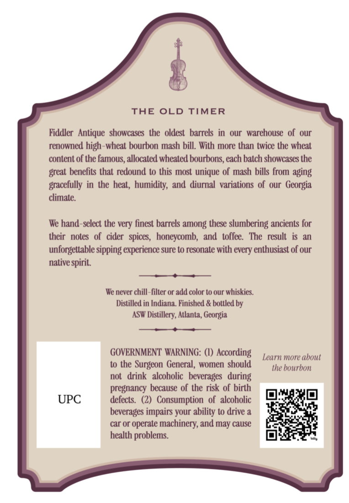
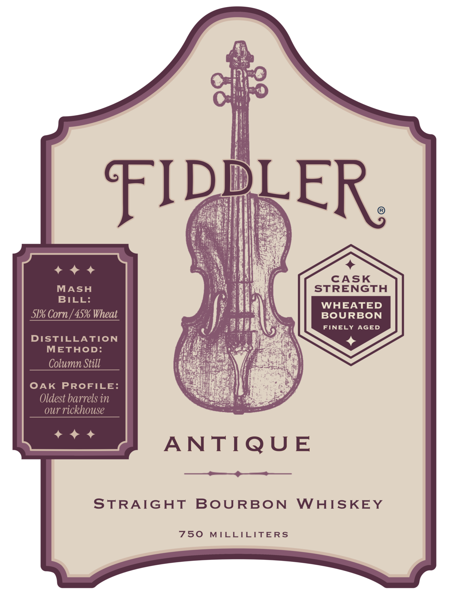
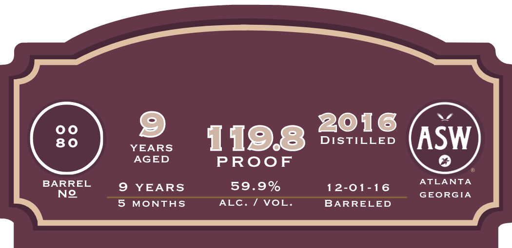

# TTB COLA Label Images - TTBID 26205001000188

**Brand Name:** FIDDLER

**Fanciful Name:** ANTIQUE

**Issue Date:** 07/29/2026

**Origin Code:** 08

**Product Class/Type:** 101

**Source:** [TTB Public COLA Registry](https://ttbonline.gov/colasonline/viewColaDetails.do?action=publicFormDisplay&ttbid=26205001000188)

## Label Images

### Back Label

### Front Label

### Label 3

## Extracted Label Text

*Text extracted via OCR - may contain errors*

**Detected Proof:** 119.8
**Detected Age:** 9 Years

### Back Label

THE
OLD
TIMER
Fiddler   Antique   showcases   the   oldest  barrels   in   our   warehouse of our
renowned high-wheat bourbon mash bill. With more than twice the wheat
content of the famous, allocated wheated bourbons, cach batch showcases the
great benefits that redound to this most unique of mash bills from aging
gracelully in the hcat, humidity;  and  diurnal  variations of our  Georgia
climate:
We hand-select the very finest barrels among these slumbering ancients for
their   notes   of   cider   spices,  honeycomb,  and   toffee:  The   result  is  an
unforgettable sipping experience sure to resonate with every enthusiast of our
native spirit
We never chill-filter or add color to our whiskies.
Distilled in Indiana. Finished & bottled by
ASW Distillery; Atlanta, Georgia
GOVERNMENT" WARNING: (I) According
Learn more about
to the Surgcon General, women should
the bourbon
not  drink   alcoholic  beverages   during
pregnancy because of the risk of birth
UPC
defects.
Consumption   of   alcoholic
beverages impairs your ability to drive a
car Or
operate machinery; and may cause
health problems.

### Front Label

FIDDLER
CASK
MASH
STRENGTH
BILL:
WHEATED
51% Corn | 45% Wheat
BOURBON
FINELY AGED
DISTILLATION
METHOD:
Column Still
OAK
PROFILE:
Oldest barrels in
our rickhouse
ANTIQU E
STRAIGAT
BoURBON
WAISKEY
750
MILLILITERS

### Label 3

2016
YEARS
1198
DISTILLED
ASW
AGED
PROoF
BARREL
9
YEARS
59.9%
12-01-16
ATLANTA
Ne
GEORGIA
5
MONTHS
ALC. / VoL.
BARRELED
