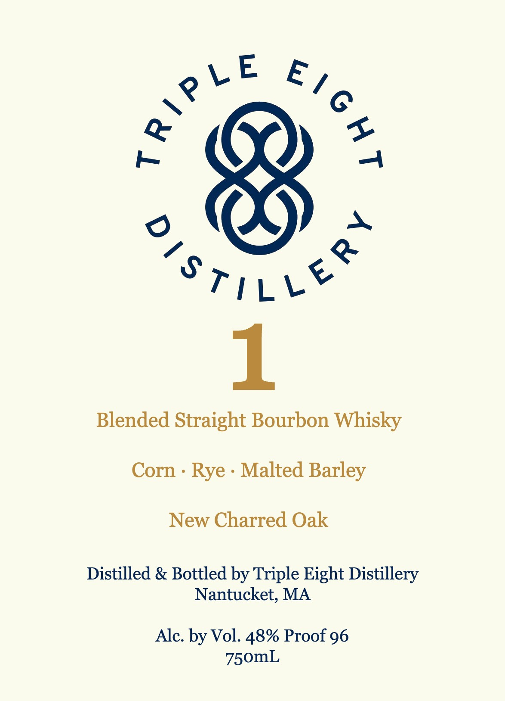
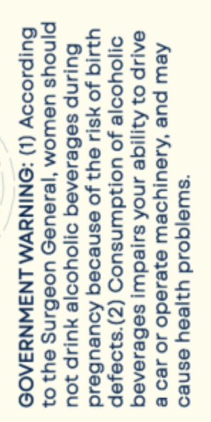

# TTB COLA Label Images - TTBID 26205001000217

**Brand Name:** TRIPLE EIGHT DISTILLERY

**Issue Date:** 07/29/2026

**Origin Code:** 26

**Product Class/Type:** 121

**Source:** [TTB Public COLA Registry](https://ttbonline.gov/colasonline/viewColaDetails.do?action=publicFormDisplay&ttbid=26205001000217)

## Label Images

### Label 1

### Label 2

## Extracted Label Text

*Text extracted via OCR - may contain errors*

**Detected Proof:** 96

### Label 1

) »

SritLe

Blended Straight Bourbon Whisky

Corn - Rye - Malted Barley

New Charred Oak

Distilled & Bottled by Triple Eight Distillery

Nantucket, MA

Alc. by Vol. 48% Proof 96

750mL

### Label 2

*swejqoid yijeey esneo

Aew pue ‘Aueujyoew ejesedo jo seo 8
BALIP 0} A3I/1GE ANOA sujedw seBeseneq
DOYyooje Jo UO!WdWNSUOD (Z)"s}Oejep
Ug JO HSIU 642 JO esNnedeg AoueuBeid
Burinp seBeieneg o1joYyooje YUP JOU
Pinoys UeWOM ‘}es8UeH UOSBNS Oy} 07
Bu|psoooy (1) :ONINYWM LNSWNYSA09
