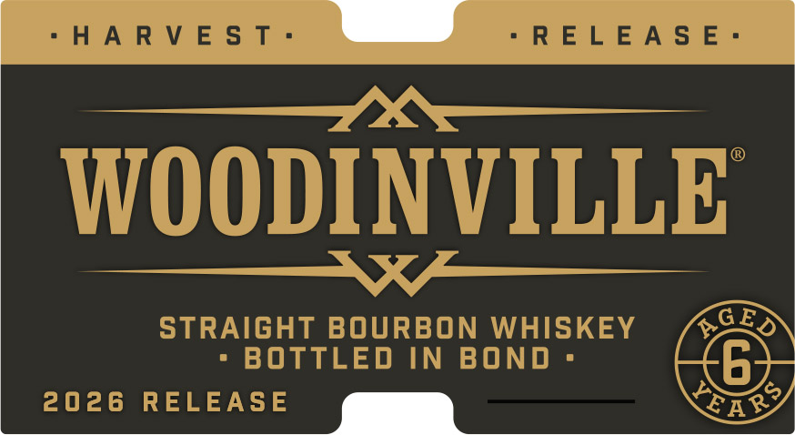
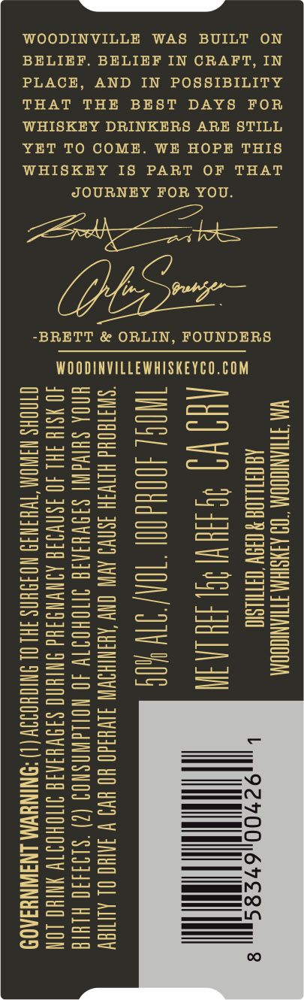
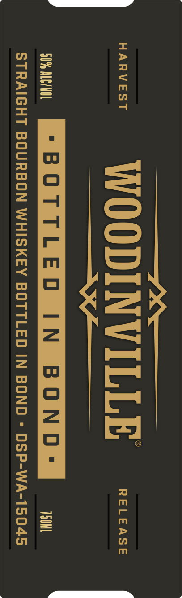
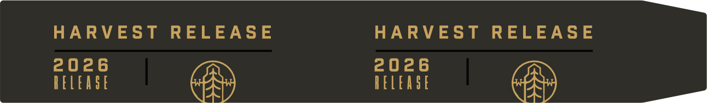

# TTB COLA Label Images - TTBID 26205001000453

**Brand Name:** WOODINVILLE

**Fanciful Name:** BOTTLED IN BOND

**Issue Date:** 07/30/2026

**Origin Code:** 07

**Product Class/Type:** 111

**Source:** [TTB Public COLA Registry](https://ttbonline.gov/colasonline/viewColaDetails.do?action=publicFormDisplay&ttbid=26205001000453)

## Label Images

### Front Label

### Label 2

### Label 3

### Label 4

## Extracted Label Text

*Text extracted via OCR - may contain errors*

### Front Label

WOODINVILLE

STRAIGHT BOURBON WHISKEY /4,220
- BOTTLED IN BOND = (Be

2026 RELEASE ,lhC«<Y LORE

### Label 2

WOODINVILLE WAS BUILT ON

BELIEF. BELIEF IN CRAFT, IN

PLACE, AND IN POSSIBILITY
THAT THE BEST DAYS FOR

WHISKEY DRINKERS ARE STILL
YET TO COME. WE HOPE THIS

WHISKEY IS PART OF THAT

JOURNEY FOR YOU.

Ce eae

Oe ae

-BRETT & ORLIN, FOUNDERS

WOODINVILLEWHISKEYCO.COM

YAN TTIIANIOOOM °
AG OHILL08

AR

INOS 008d

‘SWATGOUd H
UNOA SHI
40 YS18 IHL
OINOHS NAW

1
MH
l

TWH

AAYSIAA STTIANIGOON
(HOV OITILSIO
[751 He LAIN
TOA TTY OS
VO AVIN CNW ARSWIHOWIN JIVH3d0 WO WYO V INNHO OL ALITIOV
AIG QOHOITY 40 NOILGWASNOD (2) $199430 HLHIE
Jd AINWNDIHd INIHNO SIOVHINIG INOWOITY YNIHO LOW
J NOISHNS 3H! OL SNIOHOIIY (1) ONINGWAA LNAWNYSA09

### Label 3

$x$

wer WOODINVILLE «=

Sa

mie “BOTTLED IN BOND: 13M
STRAIGHT BOURBON WHISKEY BOTTLED IN BOND « DSP-WA-15045

### Label 4

HARVEST RELEASE HARVEST RELEASE
2026 2026
DELEASE RELEASE
