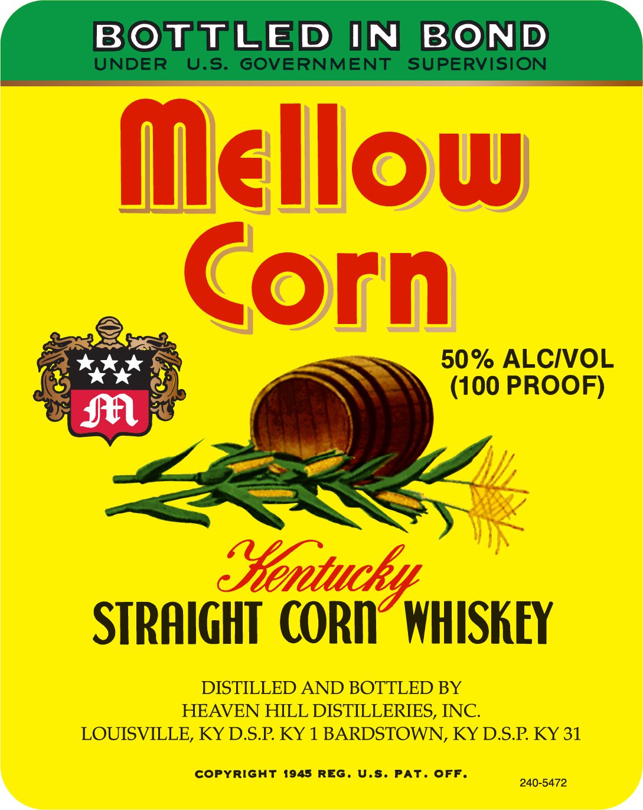
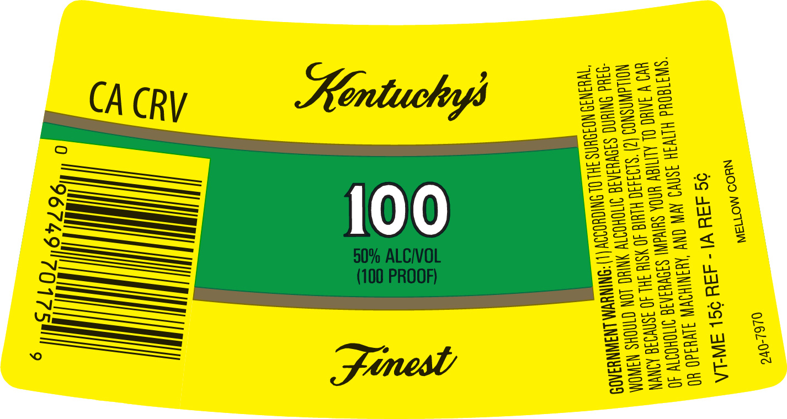
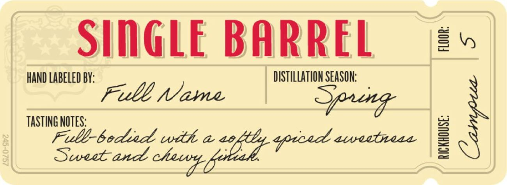

# TTB COLA Label Images - TTBID 26205001000504

**Brand Name:** MELLOW CORN

**Issue Date:** 08/03/2026

**Origin Code:** 22

**Product Class/Type:** 103

**Source:** [TTB Public COLA Registry](https://ttbonline.gov/colasonline/viewColaDetails.do?action=publicFormDisplay&ttbid=26205001000504)

## Label Images

### Label 1

### Label 2

### Label 3

## Extracted Label Text

*Text extracted via OCR - may contain errors*

*1 image(s) excluded: text did not meet readability threshold*

**Detected Proof:** 100

### Label 1

BOTTLED IN
BOND
UNDER
U.s:
GOVERNMENT
SUPERVISION
Mellow
Gorn
50% ALCIVOL
(100 PROOF)
JAl
Sentuchy
STRAIGHT  CORD  WHISKEY
DISTILLED AND BOTTLED BY
HEAVEN HILL DISTILLERIES, INC
LOUISVILLE, KY DSP KY 1 BARDSTOWN, KY DSP KY 31
copyright
1945 REG . U.s. PAT. Off
240-5472

### Label 3

SIGLE BARREL
2
HAND LABELED BY:
DISTILLATION SEASON:
Full Name
Sang
1
TASTING NOTES:
Fulb-bedied with @ 4o,
aueebea
1
8
Sweet
aprced
chaedk-Do21
and
