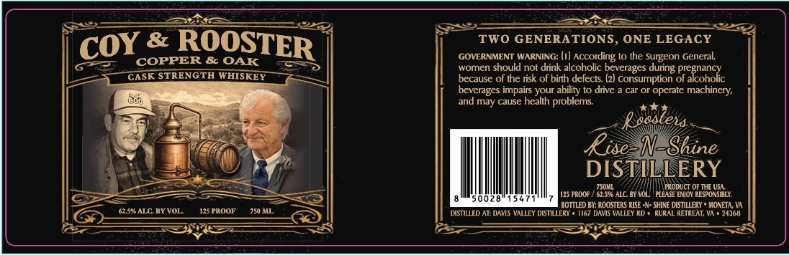

# TTB COLA Label Images - TTBID 26205001000632

**Brand Name:** COY & ROOSTER

**Issue Date:** 07/30/2026

**Origin Code:** 05

**Product Class/Type:** 140

**Source:** [TTB Public COLA Registry](https://ttbonline.gov/colasonline/viewColaDetails.do?action=publicFormDisplay&ttbid=26205001000632)

## Label Images

### Label 1

## Extracted Label Text

*Text extracted via OCR - may contain errors*

**Detected Proof:** 125

### Label 1

ROOSTER
TWO GENERATIONS, ONE LEGACY
COPPER & OAK
GOVERNMENT WARNING: (I) According to the Surgeon General;
women should not drink alcoholic beverages during
CASK STRENGTH WHISKEY
because of the risk of birth defects (2) consumption
Drekanolc
beverages impairs your ability to drve
car Or operate
machinery;
and may cause health
problems
Reosteta
Rise_N-Shine
DISTILLERY
TS0ML
PRODUCT OF THE USL
125 PROOF
62.5% ALC BY HOLI
PLEASE ENJOY RESPONSELY:
0028
BOTTLED BY: ROOSTERS EISE N- SHINE DLSTILLERY
MONETA, VA
62.S ALC BY VOL
125 PROOF
750 ML
DISTILLED AT: DAVIS VALLEY DISTILLERY
1167 DAMS VALLEY RD
Rukal
RETREAT; VA
24368
COY
