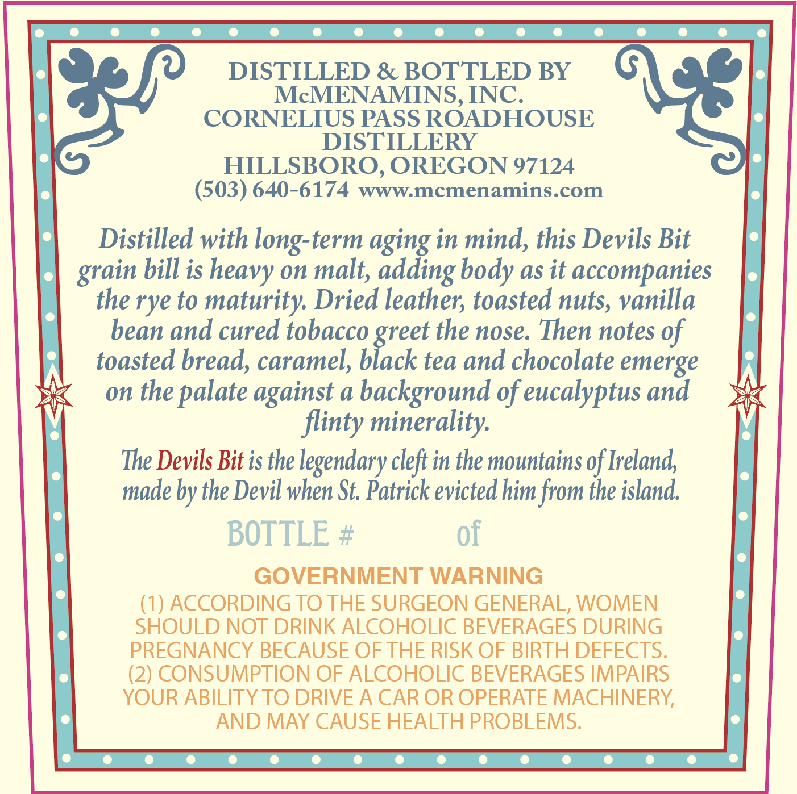
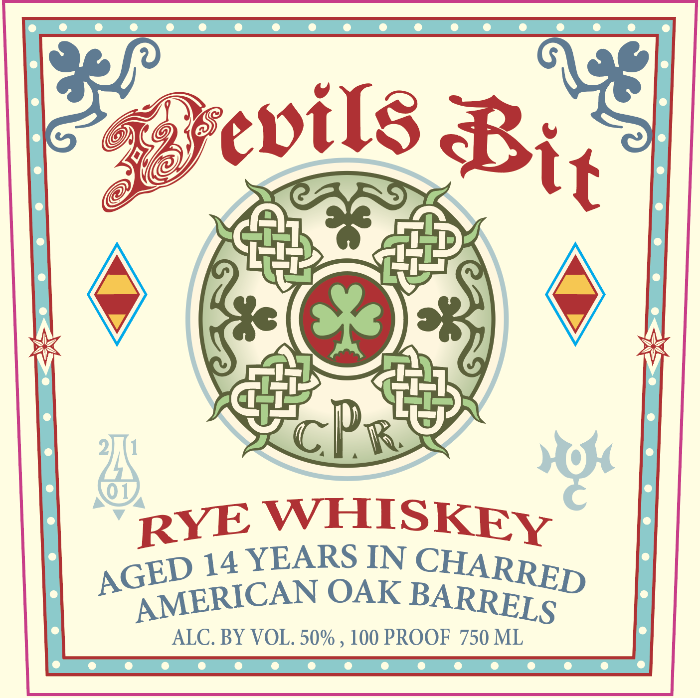

# TTB COLA Label Images - TTBID 26205001000655

**Brand Name:** DEVILS BIT

**Issue Date:** 07/30/2026

**Origin Code:** 38

**Product Class/Type:** 142

**Source:** [TTB Public COLA Registry](https://ttbonline.gov/colasonline/viewColaDetails.do?action=publicFormDisplay&ttbid=26205001000655)

## Label Images

### Back Label

### Front Label

## Extracted Label Text

*Text extracted via OCR - may contain errors*

**Detected Proof:** 100
**Detected Age:** 14 Years

### Back Label

DISTILLED & BOTTLED BY
McMENAMINS, INC.
CORNELIUS PASS ROADHOUSE
DISTILLERY
HILLSBORO, OREGON 97124
(503) 640-6174
wWWmcmenamins.com
Distilled with long-term aging in mind, this Devils Bit
bill is heavy on malt; adding body as it accompanies
the rye to maturity Dried leather; toasted nuts, vanilla
bean and cured tobacco_
the nose: Then notes of
toasted bread, caramel;
"Olacet
tea and chocolate emerge
on the
palate against a background of eucalyptus and
flinty minerality:
The Devils Bit is the legendary cleft in the mountains of Ireland,
made by the Devil when St Patrick evicted him from the island
BOTTLE #
of
GOVERNMENT WARNING
(1) ACCORDING TO THE SURGEON GENERAL, WOMEN
SHOULD NOT DRINK ALCOHOLIC BEVERAGES DURING
PREGNANCY BECAUSE OF THE RISK OF BIRTH DEFECTS.
(2) CONSUMPTION OF ALCOHOLIC BEVERAGES IMPAIRS
YOUR ABILITYTO DRIVE A CAR OR OPERATE MACHINERY
AND MAY CAUSE HEALTH PROBLEMS.
grain

### Front Label

epils
cbr
WHISKEY
14 YEARS IN
OAK
ALC. BY VOL. 50%
100 PROOF 750 ML
Bit
RYE
CHARRED
AGED
AMERICAN
BARRELS
