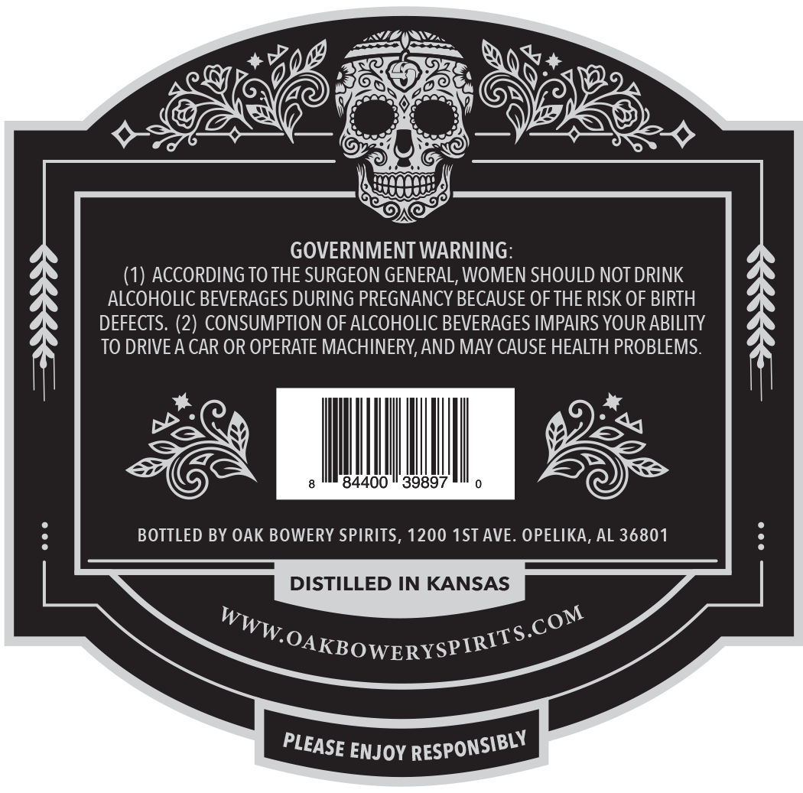
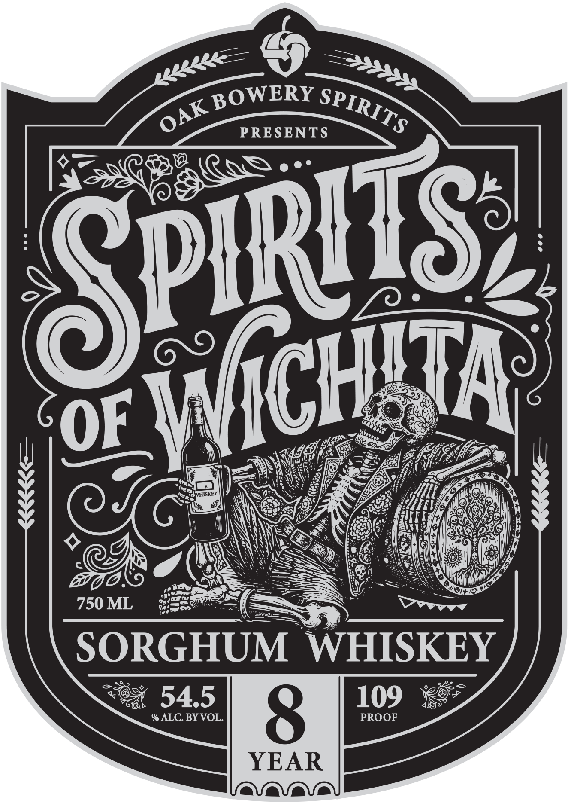

# TTB COLA Label Images - TTBID 26207001000052

**Brand Name:** SPIRITS OF WICHITA

**Issue Date:** 07/31/2026

**Origin Code:** 10

**Product Class/Type:** 140

**Source:** [TTB Public COLA Registry](https://ttbonline.gov/colasonline/viewColaDetails.do?action=publicFormDisplay&ttbid=26207001000052)

## Label Images

### Back Label

### Front Label

## Extracted Label Text

*Text extracted via OCR - may contain errors*

### Back Label

GOVERNMENT WARNING:
(1) ACCORDING TO THE SURGEON GENERAL, WOMEN SHOULD NOT DRINK
ALCOHOLIC BEVERAGES DURING PREGNANCY BECAUSE OF THE RISK OF BIRTH
DEFECTS. (2) CONSUMPTION OF ALCOHOLIC BEVERAGES IMPAIRS YOUR ABILITY
TO DRIVEA CAR OR OPERATE MACHINERY,AND MAY CAUSE HEALTH PROBLEMS.
84400
39897
BOTTLED BY OAK BOWERY SPIRITS, 1200 1ST AVE . OPELIKA, AL 36801
DISTILLED IN KANSAS
WWW OAKBOWERYSPIRITS
ENJOY
.COM
RESPONSIBLY
PLEASE

### Front Label

BOWERY
PRESENTS
OF
HISKEY
750 ML
SORGHUM
WHISKEY
54.5
109
% ALC. BYVOL
8
PROOF
YEAR
SPIRITS
OAK
) PIRITS:
WICHD
TA:
