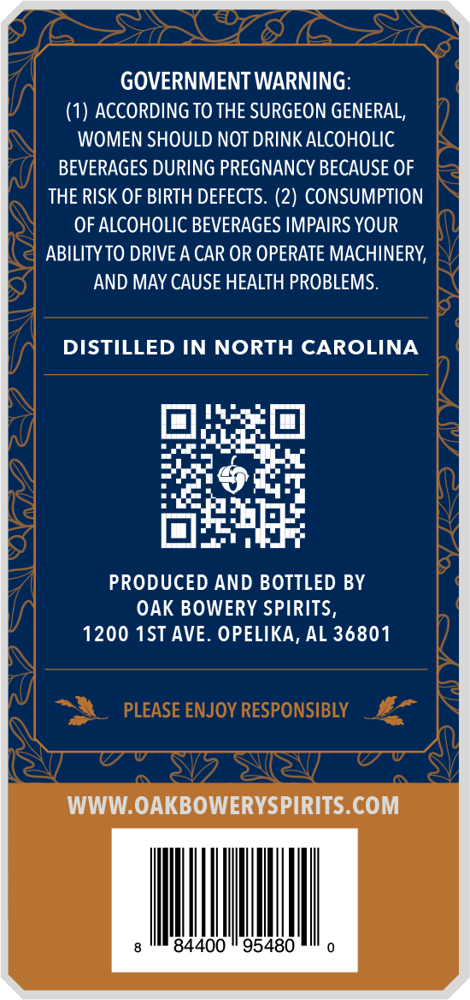
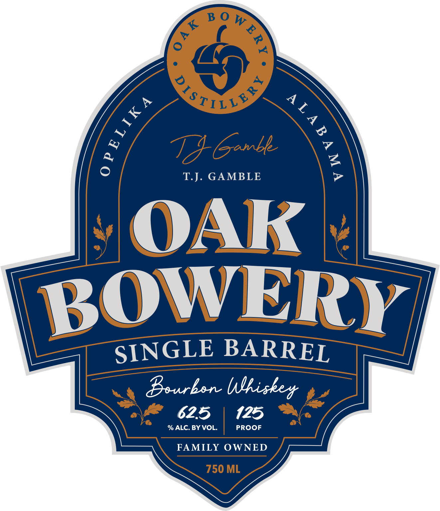
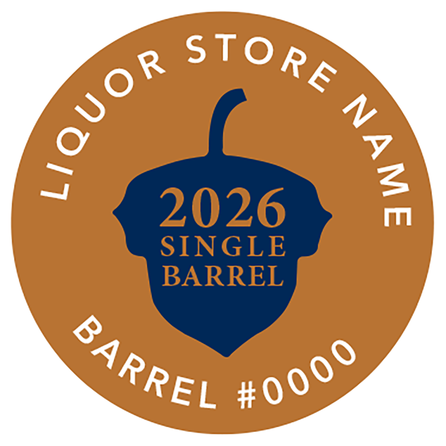

# TTB COLA Label Images - TTBID 26207001000053

**Brand Name:** OAK BOWERY

**Issue Date:** 07/31/2026

**Origin Code:** 10

**Product Class/Type:** 141

**Source:** [TTB Public COLA Registry](https://ttbonline.gov/colasonline/viewColaDetails.do?action=publicFormDisplay&ttbid=26207001000053)

## Label Images

### Back Label

### Front Label

### Label 3

## Extracted Label Text

*Text extracted via OCR - may contain errors*

*1 image(s) excluded: text did not meet readability threshold*

### Back Label

GOVERNMENT WARNING:
ACCORDING TO THE SURGEON GENERAL,
WOMEN SHOULD NOT DRINK ALCOHOLIC
BEVERAGES DURING PREGNANCY BECAUSE OF
THE RISK OF BIRTH DEFECTS. (2) CONSUMPTION
OF ALCOHOLIC BEVERAGES IMPAIRS YOUR
ABILITY TO DRIVE A CAR OR OPERATE MACHINERY;
AND MAY CAUSE HEALTH PROBLEMS.
DISTILLED IN NORTH CAROLINA
PRODUCED AND BOTTLED BY
OAK BOWERY SPIRITS,
1200 1ST AVE. OPELIKA, AL 36801
PLEASE ENJOY RESPONSIBLY
WWW.OAKBOWERYSPIRITS.COM
84400
95480

### Front Label

B 0 W
871/v
Ganbe
0
T.J.
GAMBLE
7
OAK
BOWERY
SINGLE BARREL
Bourbon Wlhiskey
625
125
% ALC. BY VOL.
PROOF
FAMILY
OWNED
750 ML
4
:
A L _
1
6
2
