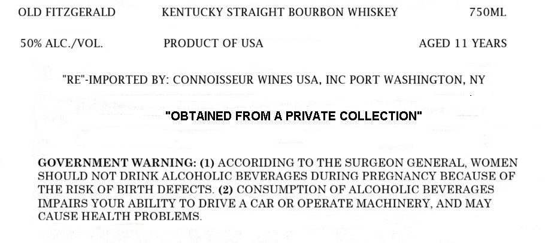
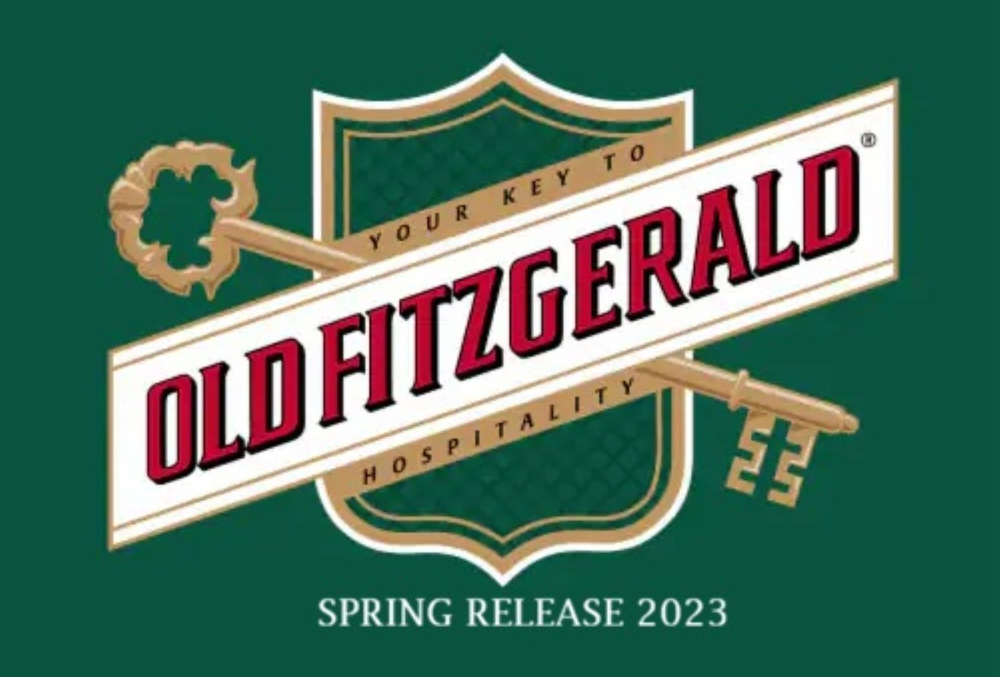

# TTB COLA Label Images - TTBID 26207001000080

**Brand Name:** OLD FITZGERALD

**Fanciful Name:** AGED 11 YEARS FALL SPRING RELEASE

**Issue Date:** 07/31/2026

**Origin Code:** 02

**Product Class/Type:** 101

**Source:** [TTB Public COLA Registry](https://ttbonline.gov/colasonline/viewColaDetails.do?action=publicFormDisplay&ttbid=26207001000080)

## Label Images

### Label 1

### Label 2

## Extracted Label Text

*Text extracted via OCR - may contain errors*

*1 image(s) excluded: text did not meet readability threshold*

**Detected Proof:** 100
**Detected Age:** 11 Years

### Label 1

OLD FITZGERALD
KENTUCKY STRAIGHT BOURBON WHISKEY
75OML
50% ALC /VOL
PRODUCT OF USA
AGED 11 YEARS
"RE"-IMPORTED BY: CONNOISSEUR WINES USA, INC PORT WASHINGTON
NY
"OBTAINED FROM A PRIVATE COLLECTION"
GOVERNMENT WARNING: (1) ACCORIDING TO THE SURGEON GENERAL, WOMEN
SHOULD NOT DRINK ALCOHOLIC BEVERAGES DURING PREGNANCY BECAUSE OF
THE RISK OF BIRTH DEFECTS. (2) CONSUMPTION OF ALCOHOLIC BEVERAGES
IMPAIRS YOUR ABILITY TO DRIVE A CAR OR OPERATE MACHINERY, AND MAY
CAUSE HEALTH PROBLEMS
