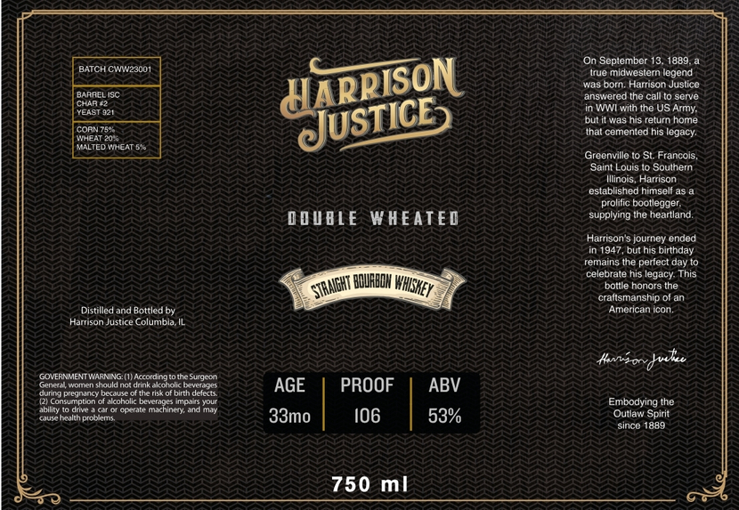

# TTB COLA Label Images - TTBID 26207001000117

**Brand Name:** HARRISON JUSTICE

**Issue Date:** 07/31/2026

**Origin Code:** 04

**Product Class/Type:** 101

**Source:** [TTB Public COLA Registry](https://ttbonline.gov/colasonline/viewColaDetails.do?action=publicFormDisplay&ttbid=26207001000117)

## Label Images

### Label 1

## Extracted Label Text

*Text extracted via OCR - may contain errors*

**Detected Proof:** 106

### Label 1

On September 13
1889
BATCH CWW23001
true midwestern legend
born , Harrison Juslice
OaraclSC
answered the call t0 serve
Ch4R ?
YDiST921
WWI with the US Army:
but it was his return home
CORN 752
that cemented his legacy:
Adcenue
Aaag
Fmeat 5%
Greenville
St_ Francois
Saint Louis I0 Soulhemn
Illinois , Harrison
established himseli as
prolitic bootlegger;
0OUBLE
WHEATED
supplying the heartland:
Harrison' $ journey ended
in 1947,but his birthday
remains the perfect day
celebrale his legacy: This
{BQRBDH
bolile honars the
craftsmanship
Distilled and Bottled by
American icon ,.
Harrison Justice Columbia,
Kvsordvke
CONERNMENMNMRANING
Wccordingt0tnesugecic
eenel eomnenchauld noldrinkakendlic teen
AGE
PROOF
ABV
dunna prcrnancy bedusc
Ule TiS otbirth dcicats
lannsnnmncn
diconolic Dercrgl_Mpars Youi
Embodying the
abilily
Genle MnchineivAold
Teie
Ualth pioocmt
33m0
106
53%
Spirit
since 1889
750
ml
4832501'
STRAGHT
WhSKeY
Qulla "
