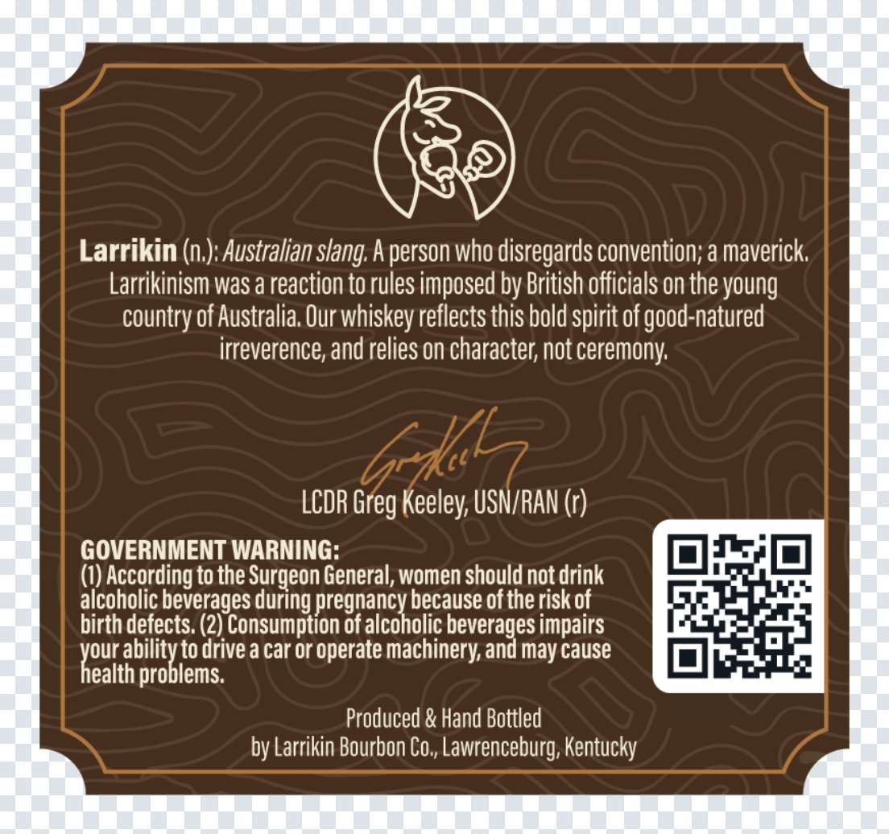
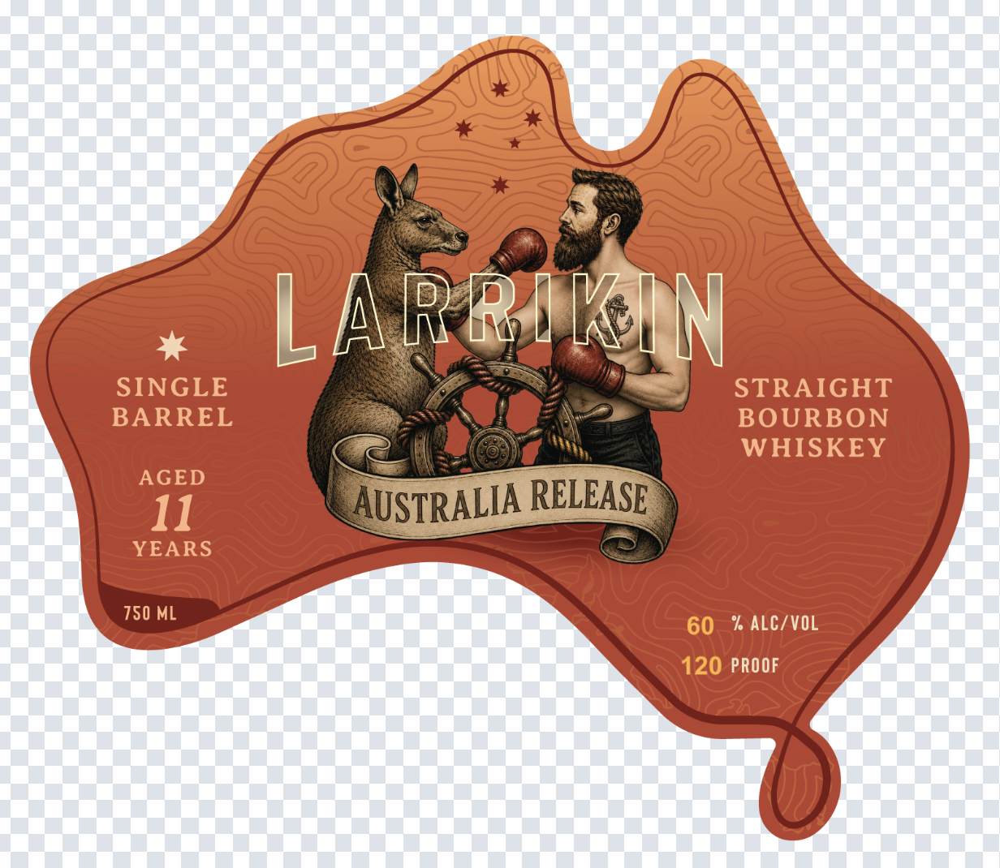

# TTB COLA Label Images - TTBID 26207001000133

**Brand Name:** LARRIKIN

**Fanciful Name:** AUSTRALIA RELEASE

**Issue Date:** 07/31/2026

**Origin Code:** 22

**Product Class/Type:** 101

**Source:** [TTB Public COLA Registry](https://ttbonline.gov/colasonline/viewColaDetails.do?action=publicFormDisplay&ttbid=26207001000133)

## Label Images

### Back Label

### Front Label

## Extracted Label Text

*Text extracted via OCR - may contain errors*

**Detected Proof:** 120

### Back Label

Larrikin (n.): Australian slang. A person who disregards convention; a maverick.
Larrikinism was a reaction to rules imposed by British officials on the young
country of Australia. Our whiskey reflects this bold spirit of good-natured
irreverence, and relies on character, not ceremony.

LCDR Greg Keeley, USN/RAN (r)

GOVERNMENT WARNING:

(1) According to the Surgeon General, women should not drink

alcoholic beverages during pregnancy because of the risk of

birth defects, (2) Consumption of alcoholic beverages impairs

Jour ality to drive a car or operate machinery, and may cause
ealth problems.

Produced & Hand Bottled
by Larrikin Bourbon Co., Lawrenceburg, Kentucky

### Front Label

LARRIKIN
SINGLE
STRAIGHT
BARREL
BOURBON
WHISKEY
AGED
11
AUSTRALIA RELEASE
YEARS
750 ML
60
% ALCZVOL
120 PROOF
