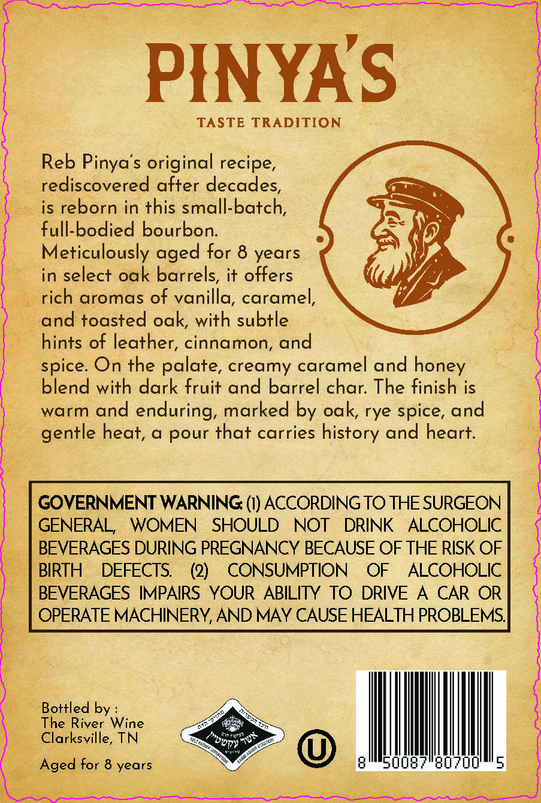
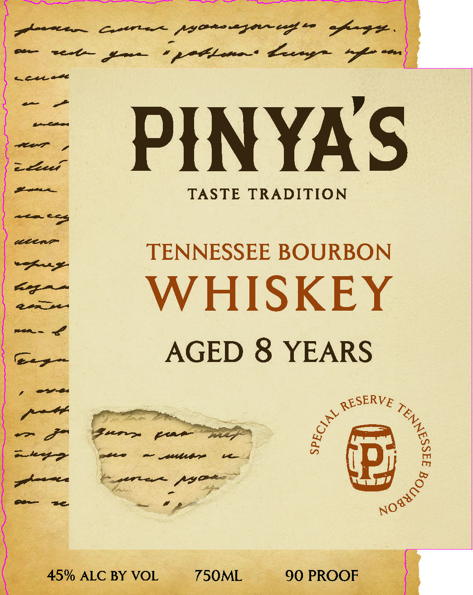
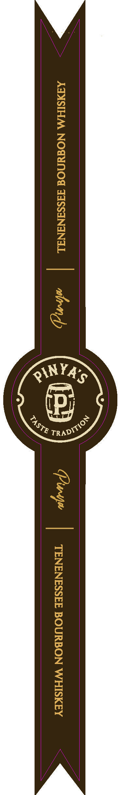

# TTB COLA Label Images - TTBID 26208001000205

**Brand Name:** PINYA'S

**Issue Date:** 08/05/2026

**Origin Code:** 43

**Product Class/Type:** 141

**Source:** [TTB Public COLA Registry](https://ttbonline.gov/colasonline/viewColaDetails.do?action=publicFormDisplay&ttbid=26208001000205)

## Label Images

### Back Label

### Front Label

### Label 3

## Extracted Label Text

*Text extracted via OCR - may contain errors*

**Detected Proof:** 90
**Detected Age:** 8 Years

### Back Label

PINYAS

TASTE TRADITION

Reb Pinya’s original recipe.

rediscovered after decades

Cm

is reborn in this small-batch

—

full-bodied bourbon

Meticulously aged for 8 years

in select oak barrels, it offers

rich aromas of vanilla, caramel

tp

and toasted oak, with subtle

hints of leather, cinnamon, and

spice. On the palate, creamy caramel and honey

blend with dark fruit and barrel char. The finish is

warm and enduring, marked by oak, rye spice, and

gentle heat, a pour that carries history and heart

GOVERNMENT WARNING (1) ACCORDING TO THE SURGEON

GENERAL, WOMEN SHOULD NOT DRINK ALCOHOLIC

BEVERAGES DURING PREGNANCY BECAUSE OF THE RISK OF

BIRTH DEFECTS.

(2)

CONSUMPTION OF ALCOHOLIC

BEVERAGES IMPAIRS YOUR ABILITY TO DRIVE A CAR OR

OPERATE MACHINERY, AND MAY CAUSE HEALTH PROBLEMS

Bottled by

The River Wine

Clarksville, TN

o Il

Aged for 8 years

SU08 "80/005

### Front Label

a Grete py ereugoneg —— afkiagse.

-

cee

eet aoe ee 4 pete Lacey =

=

te

eer

celees

PINYAS

Ee

TASTE TRADITION

© tyen a]

ee al

TENNESSEE BOURBON

ee,

ag me

ay

tense

WHISKEY

ri

=o

AGED 8 YEARS

oe

sere >

ss

—_ J”

Ry

iS

ama gad

otew

— ae ee

w

grinewen

(Bi

ie)

Co ze.

& € a ‘jue

— # pe

xo

45% ALC BY VOL

750ML

90 PROOF

_

### Label 3

APASIHM NOPUNO AASSANANAL | alrn TENENESSEE BOURBON WHISKEY
