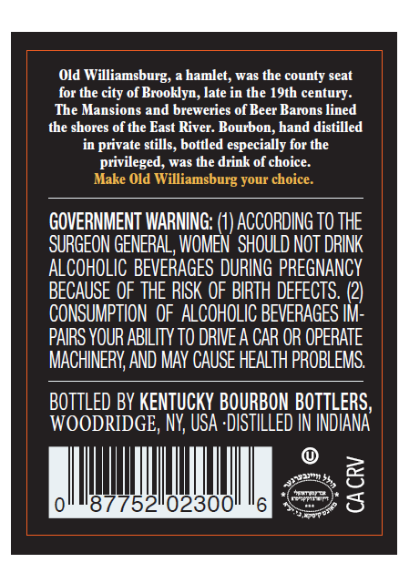
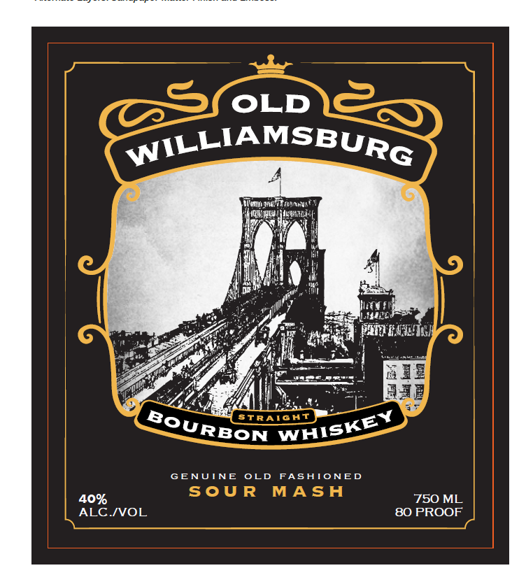
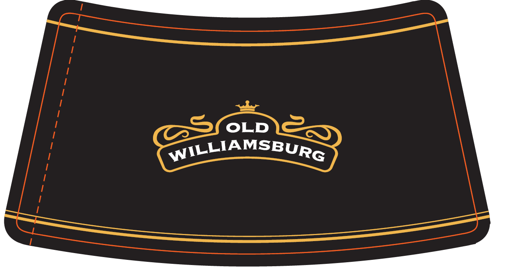

# TTB COLA Label Images - TTBID 26208001000208

**Brand Name:** OLD WILLIAMSBURG

**Issue Date:** 07/31/2026

**Origin Code:** 02

**Product Class/Type:** 101

**Source:** [TTB Public COLA Registry](https://ttbonline.gov/colasonline/viewColaDetails.do?action=publicFormDisplay&ttbid=26208001000208)

## Label Images

### Back Label

### Front Label

### Label 3

## Extracted Label Text

*Text extracted via OCR - may contain errors*

*1 image(s) excluded: text did not meet readability threshold*

**Detected Proof:** 80

### Back Label

Old
Williamsburg;
hamlet; was the county seat
for the city of Brooklyn, late in the 19th century:
The Mansions
breweries of Beer Barons lined
the shores of the East
Bourbon, hand distilled
in private stills, bottled especially for the
privileged; was the drink of choice.
Make Old Williamsburg your choice
GOVERNMENT IARNING: (1) ACCORDING TO THE
SURGEON GENERAL, WOMEN   SHOULD NOT DRINK
ALCOHOLIC BEVERAGES DURING PREGNANCY
BECAUSE OF THE RISK OF BIRTH DEFECTS.
CONSUMPTION  OF ALCOHOLIC BEVERAGES IM:
PAIRS YOUR ABILITY TO DRIVE A CAR OR OPERATE
MACHINERY,AND MAv CAUSE HEALTH PROBLEMS
BOTTLED BY KENTUCKY BOURBON BOTTLERS,
WOODRIDGE, NY; USA 'DISTILLED IN INDIANA
8
52
0230
8
and
River.

### Front Label

OLD
WILLIAMSBURG
Wovuniueg ] sudrthVa E
MWL
Iuhu
4
STRAIGAT
GENUINE
OLD
FASATONED
Sou R
MASA
40%
750 ML
ALC IVOL
80 PROOF
BOURBON
WAISKEY
