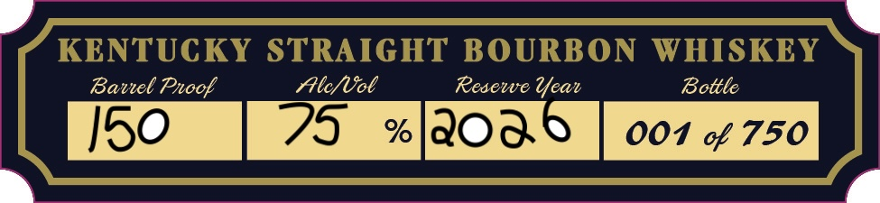
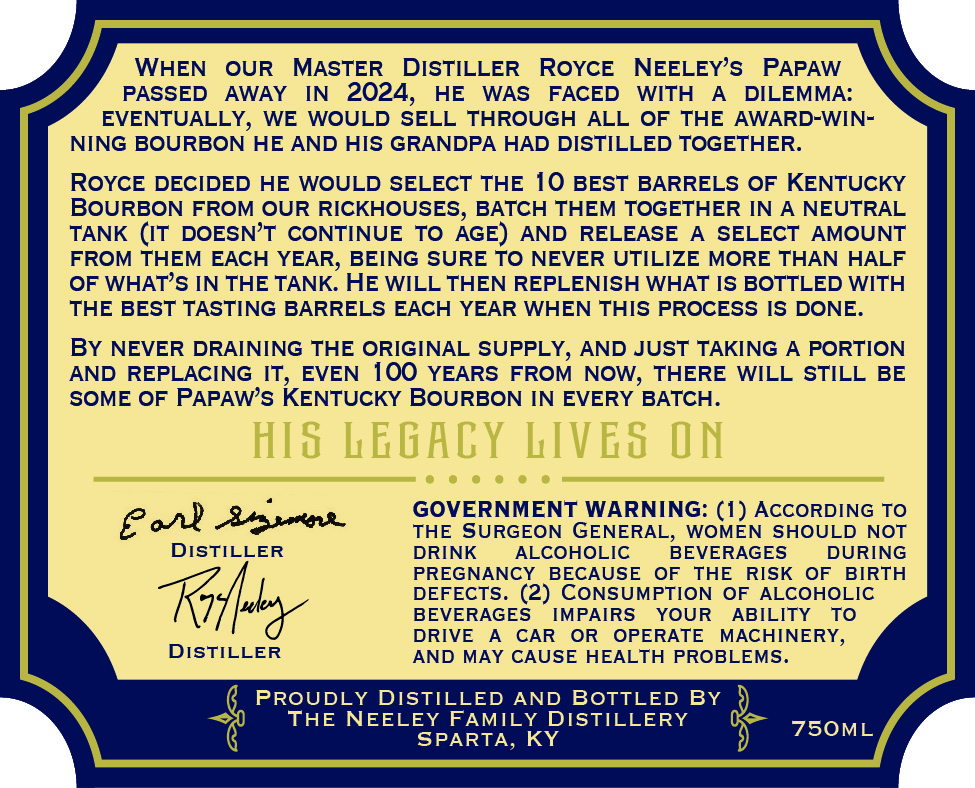

# TTB COLA Label Images - TTBID 26208001000223

**Brand Name:** PAPAW'S LEGACY RESERVE

**Issue Date:** 08/05/2026

**Origin Code:** 22

**Product Class/Type:** 101

**Source:** [TTB Public COLA Registry](https://ttbonline.gov/colasonline/viewColaDetails.do?action=publicFormDisplay&ttbid=26208001000223)

## Label Images

### Front Label

### Label 3

## Extracted Label Text

*Text extracted via OCR - may contain errors*

### Front Label

f ran? ] enT UT p DR”AR HICKRER ~
/ KENTUCKY STRAIGHT BOURBON WHISKEY
| Barrel Proof SUcfVob Resewe Year Bottle
L 001 of 750
eel

### Label 3

WHEN
OUR
MASTER
DISTILLER
ROYcE
NEELEYS
PAPAW
PASSED
AWAY
IN
2024,
HE
WAS
FACED
WITH
DILEMMA:
EVENTUALLY, WE
WOULD
SELL THROUGH
ALL
OF
THE
AWARD-WIN-
NING BOURBON HE AND HIS GRANDPA HAD DISTILLED TOGETHER_
ROYcE DECIDED
HE WOULD SELECT THE 10 BEST
BARRELS OF KENTUCKY
BOURBON FROM OUR RICKHOUSES, BATCH THEM TOGETHER IN
NEUTRAL
TANK (IT DOESNT CONTINUE TO
AGE)
AND
RELEASE
SELECT
AMOUNT
FROM THEM
EACH YEAR; BEING SURE TO NEVER UTILIZE MORE THAN HALF
OF WHATS IN THE TANK HE WILL THEN REPLENISH WHAT IS BOTTLED WITH
THE BEST TASTING BARRELS EACH YEAR WHEN THIS PROCESS IS DONE_
By NEVER DRAINING THE ORIGINAL SUPPLY, AND JUST TAKING
A PORTION
AND REPLACING IT,
EVEN
100 YEARS FROM NOW, THERE
WILL STILL
BE
SOME OF PAPAWs KENTUCKY BOURBON IN EVERY BATCH.
HIS LEGACY LIVES
ON
GOVERNMENT WARNING:
AccORDING TO
THE
SURGEON GENERAL,
WOMEN SHOULD NOT
DISTILLER
DRINK
ALCOHOLIC
BEVERAGES
DURING
PREGNANCY
BECAUSE
OF
THE
RISK
OF
BIRTH
DEFECTS. (2) CONSUMPTION OF
ALCOHOLIC
BEVERAGES
IMPAIRS
YOUR
ABILITY
To
DRIVE
CAR
OR
OPERATE
MACHINERY,
DISTILLER
AND MAY CAUSE HEALTH PROBLEMS.
PROUDLY
DISTILLED
AND
BOTTLED BY
THE NEELEY FAMILY DISTILLERY
750ML
SPARTA, KY
(1)
