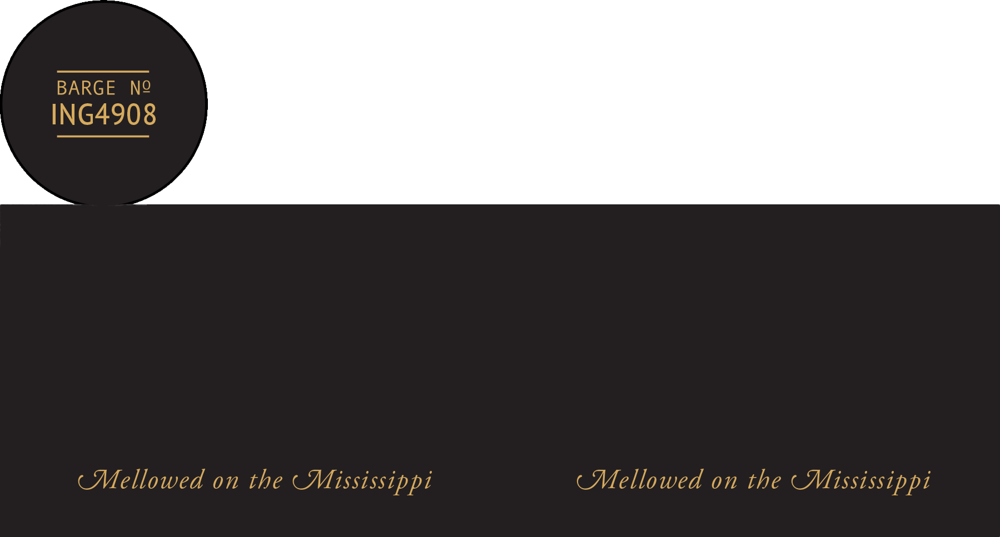

# TTB COLA Label Images - TTBID 26208001000226

**Brand Name:** FLAGSHIP

**Issue Date:** 08/10/2026

**Origin Code:** 09

**Product Class/Type:** 101

**Source:** [TTB Public COLA Registry](https://ttbonline.gov/colasonline/viewColaDetails.do?action=publicFormDisplay&ttbid=26208001000226)

## Label Images

### Front Label

## Extracted Label Text

*Text extracted via OCR - may contain errors*

### Front Label

Flagship embodies our commitment to
produce
outstanding bourbon whiskey: This limited release
bourbon
whiskey represents our finest
of the year_
BARGE
NQ
ING4908
kzkslvs
PROPRIETOR
(Mellowed on the ( Mississippi
(Mellowed on the ( Mississippi
spirit
