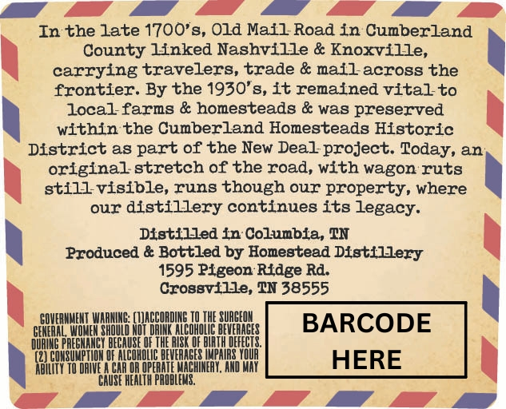
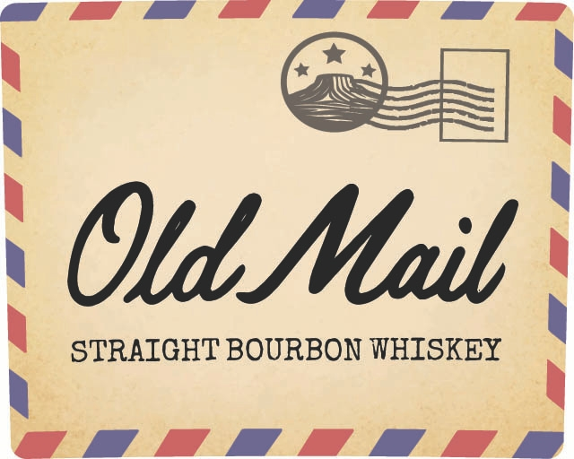

# TTB COLA Label Images - TTBID 26208001000267

**Brand Name:** OLD MAIL

**Issue Date:** 07/31/2026

**Origin Code:** 43

**Product Class/Type:** 101

**Source:** [TTB Public COLA Registry](https://ttbonline.gov/colasonline/viewColaDetails.do?action=publicFormDisplay&ttbid=26208001000267)

## Label Images

### Back Label

### Front Label

## Extracted Label Text

*Text extracted via OCR - may contain errors*

### Back Label

In the late 1700'8, Old Mail Road in Cumberland
County Linked Nashville & Knoxville,
carrying travelers, trade & mail across the
frontier. By the 1930'8, it remained vital to
local farms & homesteads & was pregerved
within the Cumberland Homesteads Historic
District a8
of the New Deal project. Today, an
original stretch of the road, with wagon ruts
still visible, runs though our property, where
our
distillery continues its legacy.
Distflled in Colunbia, TN
Produced & Bottled by Homestead Disttllery
1595 Ptgeon Rtdge Rd:
Crossvflle, TN 38555
CQVERMMEMI WAHME (WAcCQRdIne
SURGEOL
BARCODE
LITHITF
[cohoi
PREGITTICI DECHUSE QE
AISK
Luslii
COHOLIC BEVEHNGES IPHIRS
HERE
DAIVE
@OPEREL
MACHIH
CHUSE
PAOBLETE,
part
Shquld
DURTNC

### Front Label

Otd Maib
STRAIGHT BOURBON WHISKEY
