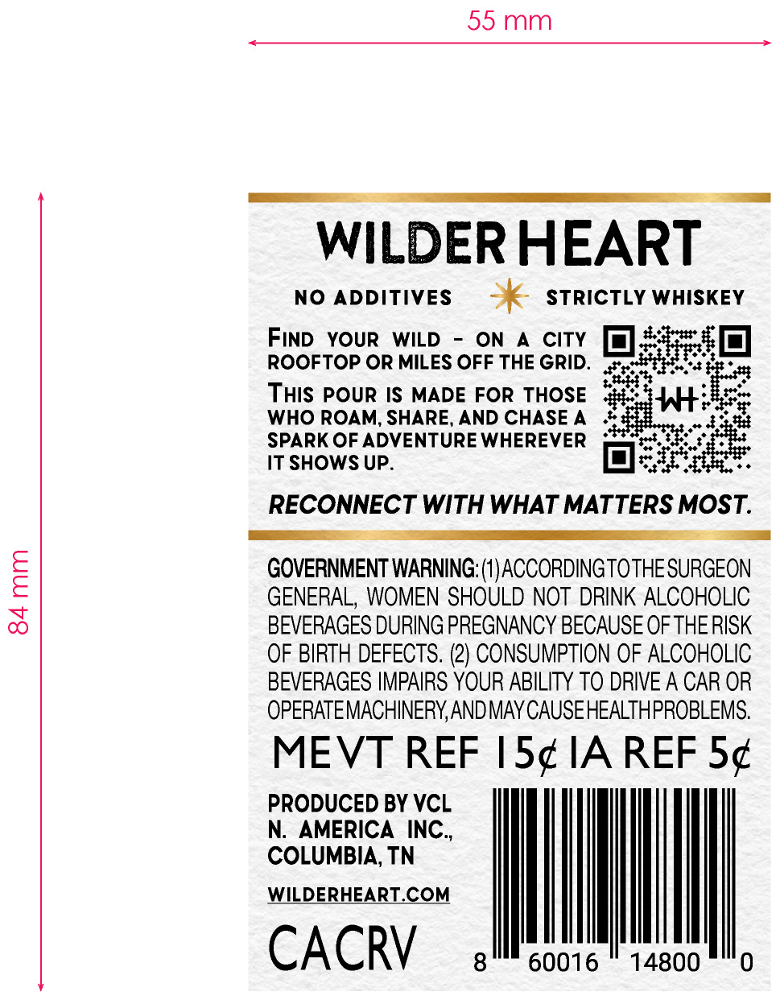
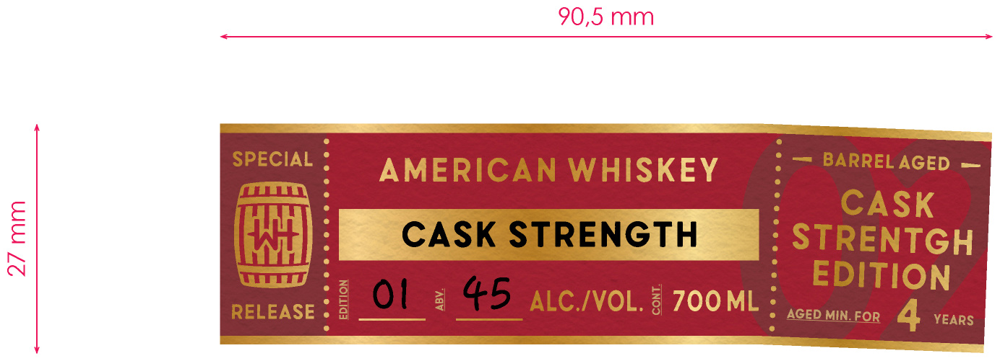
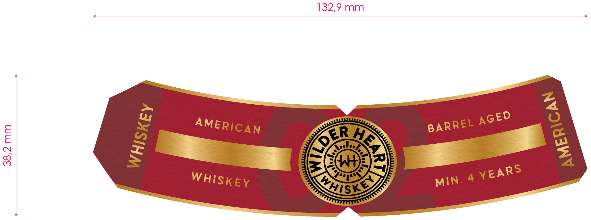

# TTB COLA Label Images - TTBID 26208001000363

**Brand Name:** WILDER HEART AMERICAN WHISKEY

**Issue Date:** 08/20/2026

**Origin Code:** 43

**Product Class/Type:** 140

**Source:** [TTB Public COLA Registry](https://ttbonline.gov/colasonline/viewColaDetails.do?action=publicFormDisplay&ttbid=26208001000363)

## Label Images

### Back Label

### Front Label

### Label 4

## Extracted Label Text

*Text extracted via OCR - may contain errors*

**Detected Age:** 4 Years

### Back Label

84mm

55mm

WILDER HEART

NO ADDITIVES > STRICTLY WHISKEY

FIND YOUR WILD - ON A CITY ORO
ROOFTOP OR MILES OFF THE GRID. sro: re
THIS POUR IS MADE FOR THOSE ‘i WHEESS
WHO ROAM, SHARE, AND CHASEA Ae
SPARK OF ADVENTURE WHEREVER poss. ae
IT SHOWS UP. | O Beteerncn

RECONNECT WITH WHAT MATTERS MOST.

GOVERNMENT WARNING: (1) ACCORDINGTOTHE SURGEON
GENERAL, WOMEN SHOULD NOT DRINK ALCOHOLIC
BEVERAGES DURING PREGNANCY BECAUSE OF THE RISK
OF BIRTH DEFECTS. (2) CONSUMPTION OF ALCOHOLIC
BEVERAGES IMPAIRS YOUR ABILITY TO DRIVE A CAR OR
OPERATEMACHINERY, AND MAY CAUSE HEALTHPROBLEMS.

MEVT REF I5¢IAREF 5¢

PRODUCED BY VCL
N. AMERICA INC.,
COLUMBIA, TN

WILDERHEART.COM

CACRYV 8 60016 ~ 14800 "0

### Front Label

90,5 mm
SPECIAL
AMERICAN WHISKEY
BARREL AGED
CASK
8
CASK STRENGTH
STRENTGH
N
EDITION
RELEASE
01
4
45
ALC IVOL. : 700ML
AGED MIN_FOR
4
YEARS

### Label 4

132,9 mm
1
4
KMse
1
0
AGED
AMERICAN
BARREL
CDER
)
YEARS
WHISKEY
MIN.
