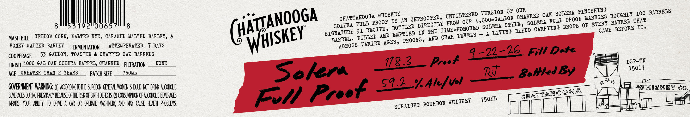
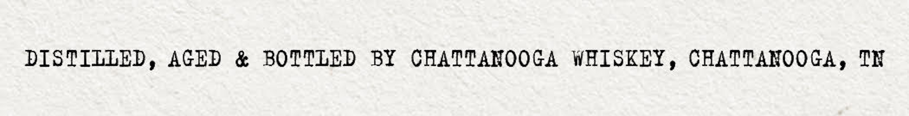

# TTB COLA Label Images - TTBID 26208001000409

**Brand Name:** CHATTANOOGA WHISKEY

**Fanciful Name:** SOLERA FULL PROOF

**Issue Date:** 08/12/2026

**Origin Code:** 43

**Product Class/Type:** 101

**Source:** [TTB Public COLA Registry](https://ttbonline.gov/colasonline/viewColaDetails.do?action=publicFormDisplay&ttbid=26208001000409)

## Label Images

### Label 1

### Label 2

## Extracted Label Text

*Text extracted via OCR - may contain errors*

**Detected Age:** 2 Years

### Label 1

VBRSION QE OTR
OAK
SOLERA
ROUGHLI  100 BARRBLS
GEATT AtooG AROOFSIS
AN
WPROOCEL  TKOI OUR
4,
Oog_<AIOTLGGABOIBROAEUSOHPRoo: OTARYERS BOJGE) K%Qg
8
53192"006571
8
~SOER E 9TIREOIQO , BOETLBD
"TIME-HONORED
STYLE ,
'GARRYIEG DROPS OF EVGRX
BEFORE IT.
SIGHATURE 91
BMPTIED IN THE
A
IIVING BLBHD
CAME
MASH BILL
YEILOW CORL,_WALTED RYE,CARAMEL_MALTED BARLEL,
BARREL, PIILBD AnD
AKD GEAR IBVBLS
FONEY   MALTED BARLEY
FERMENTATION
ATTEMPERATED ,
7 DAYS
RGROSS TARIED AGES , PROOPS ,
COOPERAGE
53 GALLOH, TOASTED & CHARRED OAK   BARRELS
9-22-26_ Fill Date
FINISH_4000 GAI OAK _ SOIBRA_BARREL, CHARRED
FILTRATION
FONE
118.2_
Proof
DSP-TH
AGE
GREATER   THAN
2 YEARS
BATCH SIZE
Z501L
Sokera
RT
Bo#led By
15017
GOVERNMENT WARNING; (1) accoRdiNgToT4E SURGEON GENERAL, WOVEN SHOULD NOT DRWK alcoholc
592 _%Ale/vol
4
WHISKEY
Co
BEVERAGES DURING PREGNANCY Because OFTHE RISK OF BIRTH DeFECTS () CONSuMPTON OF ALcOHOLIC BEVERAGES
FIl Preef
750ML
IpaRs   YOUR  ablly   to  DRVE
CAR   OR   OpERATE   MACHNERV;  AND  MAV   cauSe  HEALTh  PROBLEVS.
BOURBOK WHISKEY
FINISHING
(HATJANOOGA
WHISKEY
'ILTERED
DIRECTLY
SOLERA
WHISKEY
4R
CHATTANO@GA
STRAIGHT

### Label 2

DISTILLED , AGED
&
BOTTLED
BY
CEATTANOOGA WHISKEY , CHATTANOOGA, TN
