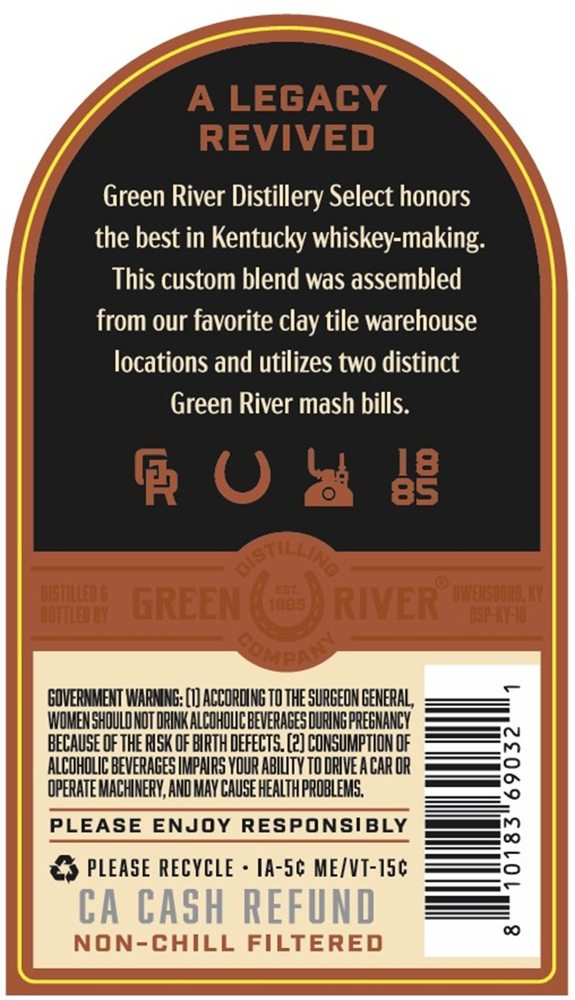
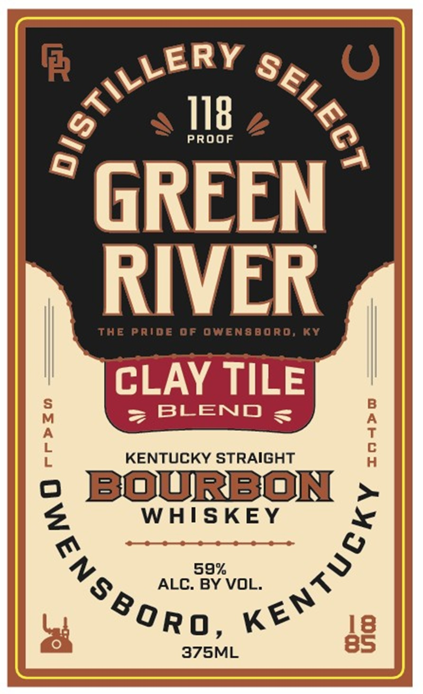
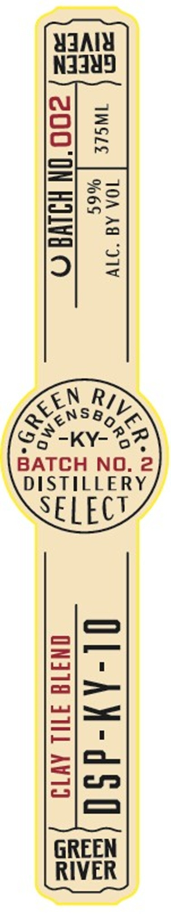

# TTB COLA Label Images - TTBID 26208001000449

**Brand Name:** GREEN RIVER

**Issue Date:** 08/03/2026

**Origin Code:** 22

**Product Class/Type:** 101

**Source:** [TTB Public COLA Registry](https://ttbonline.gov/colasonline/viewColaDetails.do?action=publicFormDisplay&ttbid=26208001000449)

## Label Images

### Back Label

### Front Label

### Label 3

## Extracted Label Text

*Text extracted via OCR - may contain errors*

**Detected Proof:** 118

### Back Label

A LEGACY
REVIVED
Green River Distillery Select honors
the best in Kentucky whiskey-making:
This custom blend was assembled
from our favorite clay tile warehouse
locations and utilizes two distinct
Green River mash bills.
R 0
8g
SStiLlins
Fureeeee

cuepeteph
altteeer
greEn
Halt
RIVER
FueENa
GOVERNMENT WARMNG; (I) ACCORDING TO THE SURGEON GENERAL
WOMENSHULDNOT ORINK ALCOHOUC BEVERAGES DURING PREGMANCY
BECAUSE Of ThE RISK OF BIRTH DEFECTS. (2) CONSUMPTION OF
ALCOHOLIC BEVERAGES IMPHRS VOUR ABIUty TO DRIVE A CaR OR
{
OPERATE MACHNERY, AND MAY CAUSE HEALTH PROBLEMG;
PLEASE ENJOY RESPONSIBLY
PLEASE RECYCLE
IA-Sc MEIVT-ISc
3
CA CASH REFUND
00
NON-CHILL FILTERED

### Front Label

R
0
118
PROOF
GREEN
RIVER
The Pride 0f Owen8boro; Ky
CLAY TILE
BLEND
1
KENTUCKY STRAIGHT
1
BOURBON
WHISKEY
59%
ALC: BY VOL.
8
375ML
85
S'STILLERP
1
9
)
CNSBOR98

### Label 3

YaAlY

N3Iu5

RS

a>

<eNS8o

2 _Ky-

RP

BATCH NO. 2

DISTILLERY

SEL EC!

GREEN

RIVER
