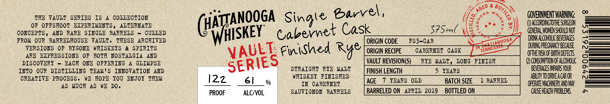

# TTB COLA Label Images - TTBID 26208001000457

**Brand Name:** CHATTANOOGA WHISKEY

**Fanciful Name:** SINGLE BARREL, CABERNET CASK FINISHED RYE

**Issue Date:** 07/31/2026

**Origin Code:** 43

**Product Class/Type:** 142

**Source:** [TTB Public COLA Registry](https://ttbonline.gov/colasonline/viewColaDetails.do?action=publicFormDisplay&ttbid=26208001000457)

## Label Images

### Label 1

## Extracted Label Text

*Text extracted via OCR - may contain errors*

**Detected Age:** 5 Years

### Label 1

THE VAULT  SERIES
IS
A
COLLECTION
Barrel ,
8
GOVERNMENT WARNING;
0
OF OFFSHOOT EIPERIMENTS ,
ALTERNATE
cSbornet
Cask
37Sml
GCOEDUOEBESDTOI
CONCEPTS ,
AND RARE  SINGLE BARRELS
CULLED
FROM OUR   BARRELHOUSE VAULT .
THESE   ARCHIVED
ORIGIN CODE
FS3-CAB
DRINKALCOHOLIC BEVERAGES
VERSIONS   OF
BYGONE   WHISKEYS
&
SPIRITS
Finihed Rye
ORIGIN RECIPE
CABERNET
CASK
OTEgBGGEHhDEE

ARE  EIPRESSIONS OF BOTF NOSTALGIA
AND
DISCOVERY
EACE ONE  OFFERING
A
GLIMPSE
VAULT REVISION(S)
RYE MALT ,
LONG   FINISH
Q} CONSUMPTON OF ALcOHOLIc
INTO   OUR
DISTILLING   TEAM
S
INNOVATION
AND
STRAIGHT RYE MALT
FINISH LENGTH
5
YEARS
BEVERAGES MMParS VOUR
CREATIVE PROCESS ,
WE   FOPE YoU ENJOX THEM
122
61
WEISKEY FINISHED
AGE
7
YEARS
OLD
BATCH SIZE
1 BARREL
ABILIy TO DRVEA CAR OR
AS   MUCF AS   WE DO.
Qo
IN CABERNET
OPERATE MACHINERY AND MAY
PROOF
ALCIVOL
SAUVIGEON BARRELS
BARRELED ON
APRIL 2019
BOTTLED ON
CAUSE HEALTHPROBLEMS
~
AGED
Bottle
(HATgANOOGA
WHISKEY"
~OHAIIANOOGA
VAULT;
"TENNESSCI
SERIES
