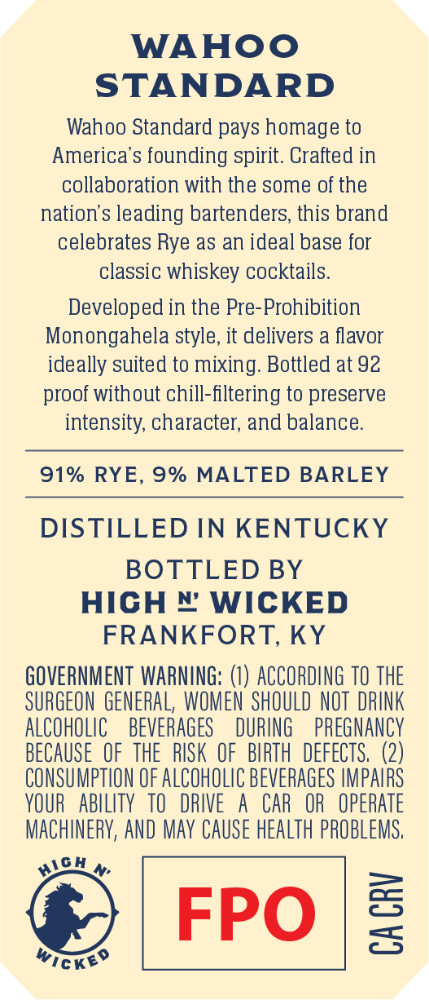
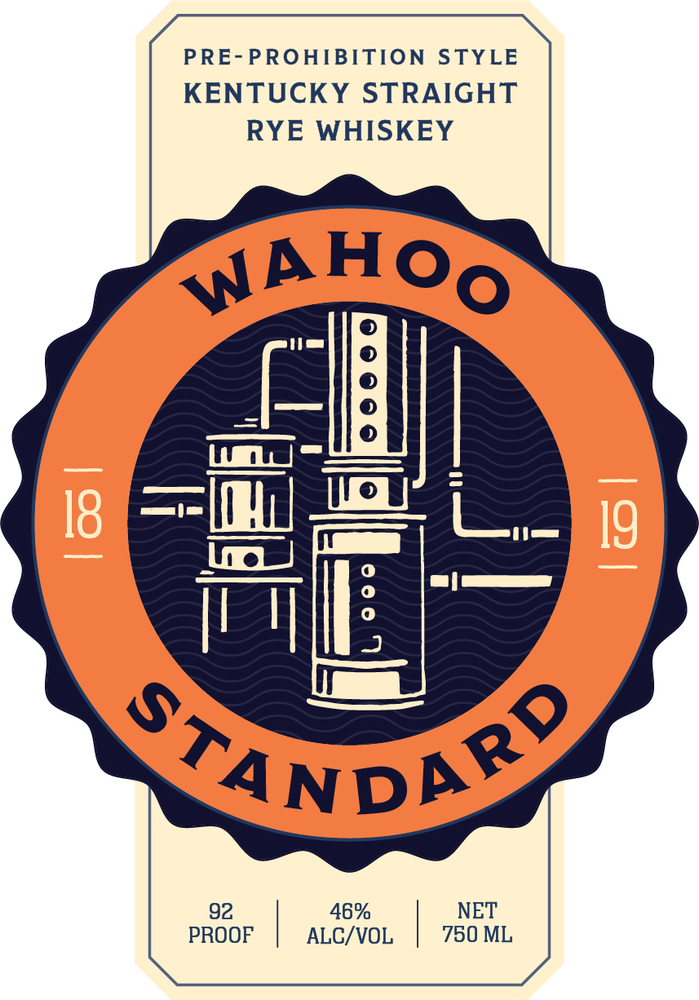

# TTB COLA Label Images - TTBID 26208001000483

**Brand Name:** WAHOO

**Issue Date:** 07/31/2026

**Origin Code:** 22

**Product Class/Type:** 102

**Source:** [TTB Public COLA Registry](https://ttbonline.gov/colasonline/viewColaDetails.do?action=publicFormDisplay&ttbid=26208001000483)

## Label Images

### Back Label

### Front Label

## Extracted Label Text

*Text extracted via OCR - may contain errors*

**Detected Proof:** 92

### Back Label

WAHOO
STANDARD
Wahoo Standard pays homage to
America's founding spirit. Crafted in
collaboration with the some of the
nation's leading bartenders, this brand
celebrates Rye as an ideal base for
classic whiskey cocktails.
Developed in the Pre-Prohibition
Monongahela style, it delivers a flavor
ideally suited to mixing: Bottled at 92
proof without chill-filtering to preserve
intensity, character; and balance.
91% RYE,
9% MALTED BARLEY
DISTILLED IN KENTUCKY
BOTTLED BY
HICH  WICKED
FRANKFORT, KY
GOVERNMENT WARNING: (1) ACCORDING TO THE
SURGEON  GENERAL, WOMEN SHOULD NOT  DRINK
AlCOhOLIC
BEVERAGES
DURING
PREGNANCY
BECAUSE   OF thE   RSK OF   BIRTH  DEFECTS,  (2)
CONSUMPTION €F ALCOHOLIC BEVERAGES IMPAIRS
YOUR   abILITY   tO   DRIVE
A
CAR
OR   OpeRATE
MACHINERY, AND MAy CauSe HeALTh PROBLEMS,
FPO
3
3
wickeo
#oh

### Front Label

PRE-PROHIBITION STYLE
KENTUCKY STRAIGHT
RYE WHISKEY

92 46% NET
PROOF ALC/VOL 750 ML
