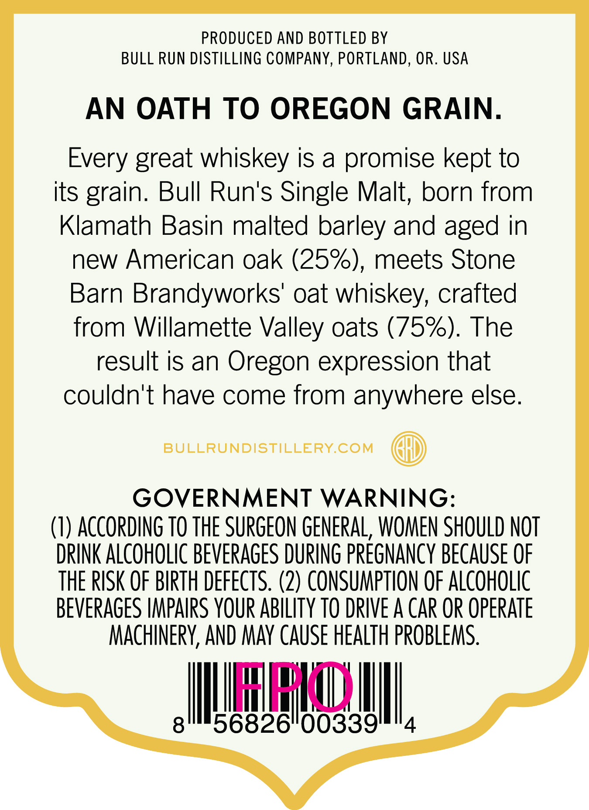
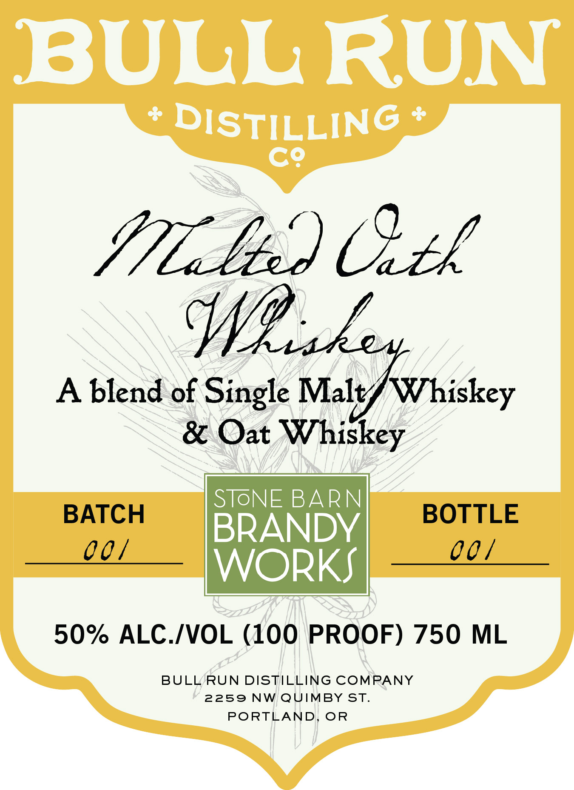

# TTB COLA Label Images - TTBID 26208001000533

**Brand Name:** BULL RUN DISTILLERY CO.

**Fanciful Name:** MALTED OATH

**Issue Date:** 09/02/2026

**Origin Code:** 38

**Product Class/Type:** 140

**Source:** [TTB Public COLA Registry](https://ttbonline.gov/colasonline/viewColaDetails.do?action=publicFormDisplay&ttbid=26208001000533)

## Label Images

### Back Label

### Front Label

### Label 2

## Extracted Label Text

*Text extracted via OCR - may contain errors*

*1 image(s) excluded: text did not meet readability threshold*

**Detected Proof:** 100

### Back Label

PRODUCED AND BOTTLED BY
BULL RUN DISTILLING COMPANY, PORTLAND, OR. USA
AN OATH TO OREGON GRAIN.
Every great whiskey is a promise kept to
its grain: Bull Run's Single Malt; born from
Klamath Basin malted barley and aged in
new American oak (25%), meets Stone
Barn Brandyworks' oat whiskey, crafted
from Willamette Valley oats (75%). The
result is an Oregon expression that
couldn't have come from anywhere else.
BULLRUNDISTILLERYCOM
GOVERNMENT WARNING:
(I) According TO THE SURGEON GENERAL, WOMEN SHOULD NOT
DRINK ALCOHOLIC BEVERAGES DURING PReGNancy BECAUSE OF
THE RISK OF BIRTH defects. (2) CONSUMPTHON OF ALCOHOLIC
BEVERAGES HMPAIRS YOUR ABILITY TO DRIVE A CAR OR OpERATe
MACHINERY, AND MaY CAUSE HEALTH PROBLeMs.
HHI
8
56826"00339'
4

### Front Label

BULL RUN
8
DISTILLING
C9
91Elsed) Utk
cAk
A blend of Single Malv/ Whiskey
& Oat
Whiskey
SToNE BARN
BATCH
BOTTLE
BRANDY
00L
0 0 |
WORKS
50% ALC IVOL (100 PROOF) 750
ML
BULL RUN DISTILLING COMPANY
2259
NW QUIMBY ST:
PORTLAND
OR
