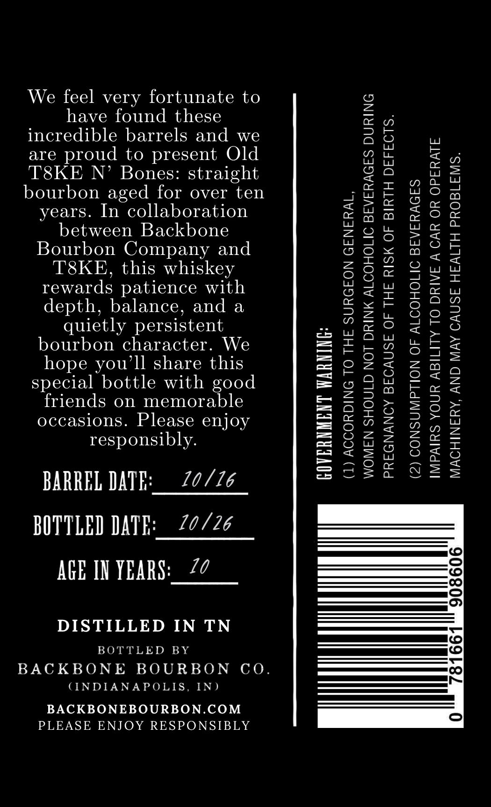
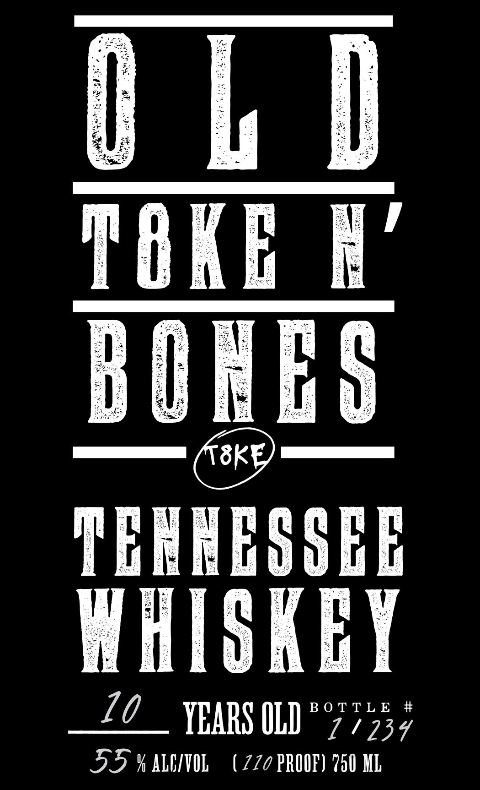

# TTB COLA Label Images - TTBID 26208001000573

**Brand Name:** OLD T8KEN' BONES

**Issue Date:** 08/04/2026

**Origin Code:** 19

**Product Class/Type:** 140

**Source:** [TTB Public COLA Registry](https://ttbonline.gov/colasonline/viewColaDetails.do?action=publicFormDisplay&ttbid=26208001000573)

## Label Images

### Back Label

### Front Label

## Extracted Label Text

*Text extracted via OCR - may contain errors*

### Back Label

We feel very fortunate to
have found these
incredible barrels and we
are proud to present Old
T8KE N’ Bones: straight
bourbon aged for over ten
years. In collaboration
between Backbone
Bourbon Company and
T8KE, this whiskey
rewards patience with
depth, balance, and a
quietly persistent
bourbon character. We
hope you'll share this
special bottle with good
friends on memorable
occasions. Please enjoy
responsibly.

BARREL DATE:__ 20/26
BOTTLED DATE:__22/26
AGE IN YEARS:_ 22

DISTILLED IN TN

BOTTLED BY

BACKBONE BOURBON CO.

CINDIANAPOLIS, IN)

BACKBONEBOURBON.COM
PLEASE ENJOY RESPONSIBLY

GOVERNMENT WARNING:

(1) ACCORDING TO THE SURGEON GENERAL,

WOMEN SHOULD NOT DRINK ALCOHOLIC BEVERAGES DURING
PREGNANCY BECAUSE OF THE RISK OF BIRTH DEFECTS.
(2) CONSUMPTION OF ALCOHOLIC BEVERAGES

IMPAIRS YOUR ABILITY TO DRIVE A CAR OR OPERATE
MACHINERY, AND MAY CAUSE HEALTH PROBLEMS.

ive)
(—)
oO
00)
i=)
fo)
nll
ite]
(vo)
—|
[ve]
hed

0

### Front Label

TERR EOSEE
WHISKEY

ZO __ YEARS OLD"°77454

SFY ALCVOL (720 PROOF) 750 ML
