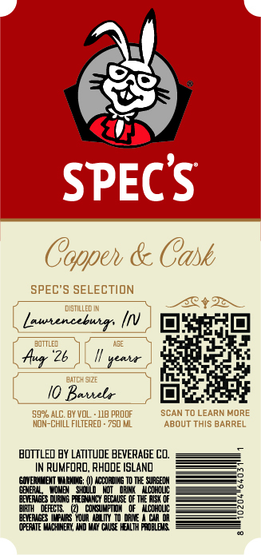
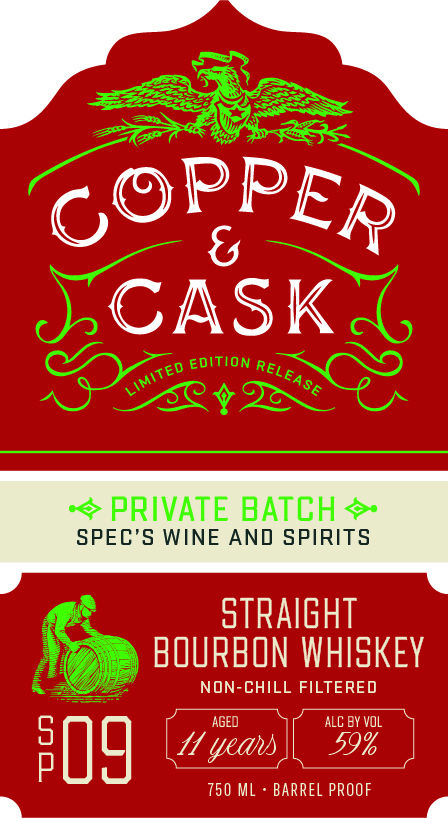

# TTB COLA Label Images - TTBID 26208001000619

**Brand Name:** COPPER & CASK

**Issue Date:** 08/03/2026

**Origin Code:** 40

**Product Class/Type:** 101

**Source:** [TTB Public COLA Registry](https://ttbonline.gov/colasonline/viewColaDetails.do?action=publicFormDisplay&ttbid=26208001000619)

## Label Images

### Back Label

### Front Label

### Label 3

## Extracted Label Text

*Text extracted via OCR - may contain errors*

**Detected Proof:** 118

### Back Label

SPECS
Coppeh & Cask
SPEC'S SELECTION
DIETILLED IN
3012
Lautencebutr;
EJTTLED
Kuq
26
#ei
BATCH SIZE
Kaueb
5992 ALC. BY VoL
118 pROOF
SCAN TO LEARN MORE
MOn-ChILL FILTERED - 750 ML
AboUT This BARREL
BQTTLED BY LATITUDE BEVERAGE CO,
Rumforo, RHODE ISLAND
GIVERMNEMT MIMINE
ICCORDING TD THE SUAGEDN
BEER4
JDld
Woi { DRINK } Wcohouc
DEciboute eow ocutqmecOo
BIRTH
DEFECTS   (2)
cOK MPTM
0f   WcOHOUC
BETERIGB INCVeS Yqur
10 DaI
cia DA
OPERATE MACHINEAY; WND MAY CAUSE HEALTH FROBLEUS

### Front Label

SCASK
EDITION
PRIVATE BATCH
SPEC'S WINE AND SPIRITS
straIghT
BOURBON WHISKEY
NON-CHILL FILTERED
AGED
ALC BY vol
50g
yeas
59%
750 ML
BARREL PROOF
PPER
G9
RELEASE
LIMITEd

### Label 3

COPPER & CASK Say

MSW 8 WdddOd

a=
