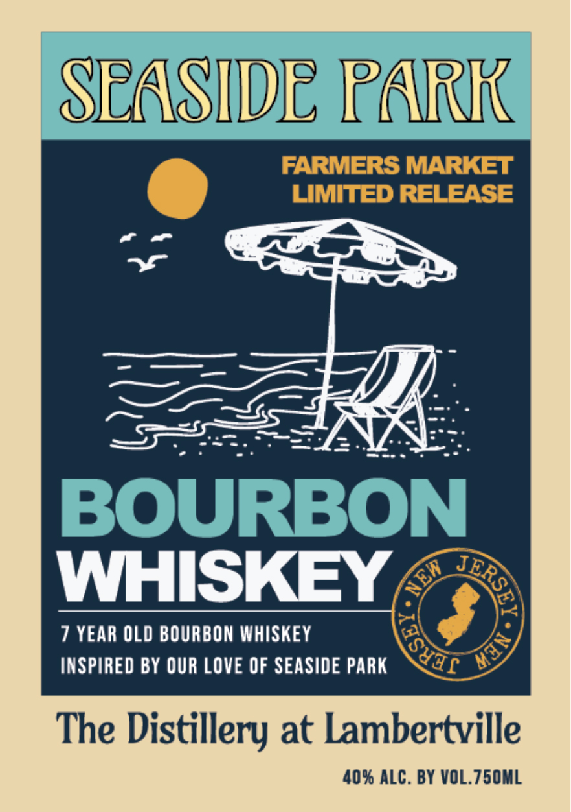

# TTB COLA Label Images - TTBID 26208001000698

**Brand Name:** SEASIDE PARK BOURBON

**Issue Date:** 08/03/2026

**Origin Code:** 03

**Product Class/Type:** 141

**Source:** [TTB Public COLA Registry](https://ttbonline.gov/colasonline/viewColaDetails.do?action=publicFormDisplay&ttbid=26208001000698)

## Label Images

### Label 1

## Extracted Label Text

*Text extracted via OCR - may contain errors*

**Detected Proof:** 80
**Detected Age:** 7 Years

### Label 1

SEASIDE PARK
FARMERS MARKET
LIMIted RELEASE
BOURBON
WHISKEY
7 YEAR OLD BOURBON WHISKEY
INSPIRED BY QUR LOVE OF SEASIDE PARK
The Distillery at Lambertville
40% ALC. BY VOL.750ML
SRSEA
NEW
MIn -
Sudf
