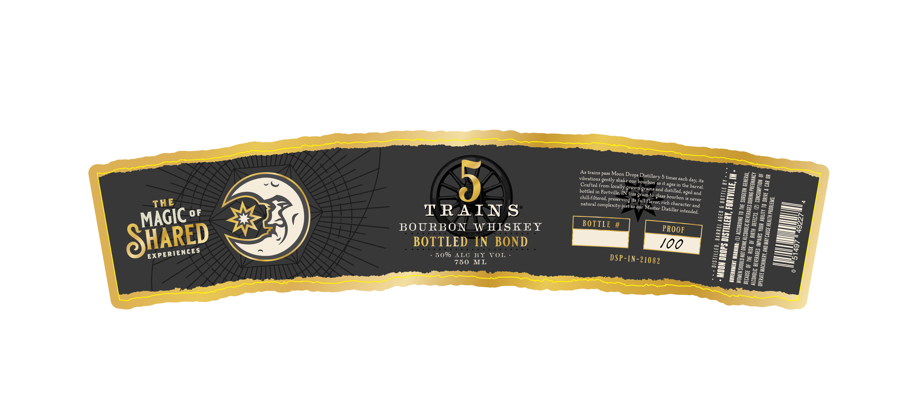

# TTB COLA Label Images - TTBID 26209001000036

**Brand Name:** MOON DROPS DISTILLERY

**Fanciful Name:** 5 TRAINS BOURBON

**Issue Date:** 08/21/2026

**Origin Code:** 19

**Product Class/Type:** 111

**Source:** [TTB Public COLA Registry](https://ttbonline.gov/colasonline/viewColaDetails.do?action=publicFormDisplay&ttbid=26209001000036)

## Label Images

### Label 1

## Extracted Label Text

*Text extracted via OCR - may contain errors*

**Detected Proof:** 100

### Label 1

As
pass
E
68
5
'dbcatieas_
gently shake our bourbon as
times each
its
5
3
from locally grown
ages in the barrel
bottled
grains and
7
in
Fortville, IN this grain-to
aged and
chill-fitered preservingits gudi flvolasscbocrbon
never
3
THE
natural
complexity-just
as
our
rich
and
06
4
2=
0F
TRAIN S
Distiller intended
2
2
1
BOURBON
W HISKEY
BOTTLE #
PROOF
2
0)
SHARED
BOTTLED IN BOND
100
2
8
50% ALC BY VOL
1
4
750
ML
DSP-IN-21082
2
8
trains-
Moon
Drops
1
|
Distillery
day,
I
1
1
1
distilled,
|
character
Master
MAGIC
[
1
I
1
8
1
1
]
EXPERIENCES
1
I
1
1
1
