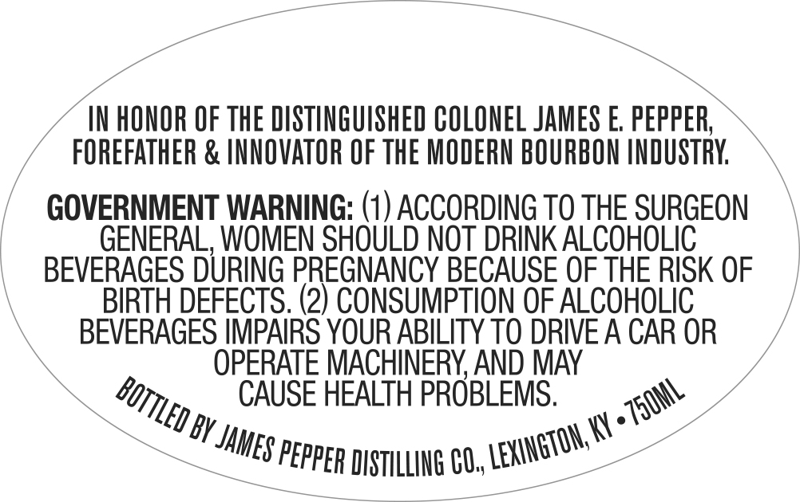
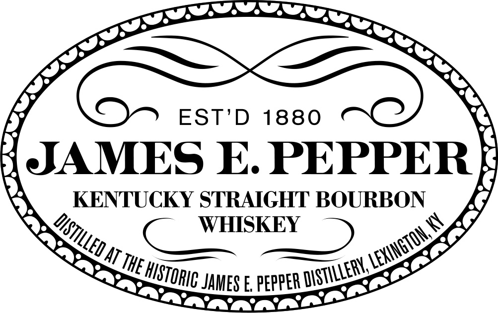
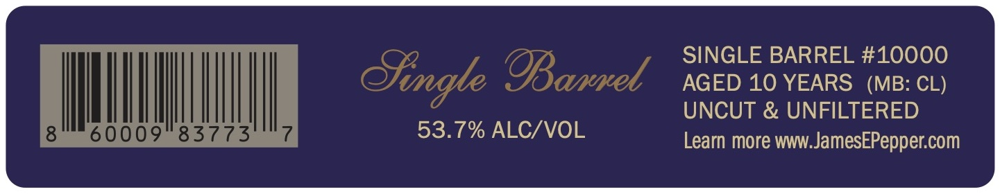

# TTB COLA Label Images - TTBID 26209001000051

**Brand Name:** JAMES E. PEPPER

**Fanciful Name:** SINGLE BARREL

**Issue Date:** 08/03/2026

**Origin Code:** 22

**Product Class/Type:** 101

**Source:** [TTB Public COLA Registry](https://ttbonline.gov/colasonline/viewColaDetails.do?action=publicFormDisplay&ttbid=26209001000051)

## Label Images

### Back Label

### Label 1

### Label 2

## Extracted Label Text

*Text extracted via OCR - may contain errors*

**Detected Proof:** 107.4
**Detected Age:** 10 Years

### Back Label

IN HONOR OF ThE DISTINGUISHED COLONEL JAMES E peppER;
FOREFATHER & INNQVATOR OF The MODERN BOURBON INDUSTRY
GOVERNMENT WARNING: (1) ACCORDING TO THE SURGEON
GENERAL, WOMEN SHOULD NOT DRINK ALCOHOLIC
BEVERAGES DURING PREGNANCY BECAUSE OF THE RISK OF
BIRTH DEFECTS. (2) CONSUMPTION OF ALCOHOLIC
BEVERAGES IMPAIRS YOUR ABILITY TO DRIVE A CAR OR
OPERATE MACHINERY AND MAY
CAUSE HEALTH PROBLEMS.
BY
KY
DISTILLING CU,,
BOTTLED
.Z7501L
LEXINGTON; V
JAMES "
PEPPER

### Label 1

EST'D
1880
JAMES E. PEPPER
KENTUCKY STRAIGHT BOURBON
WHISKEY
AT
JAMES E PEPPER
DISTILLED E
LEXINGTON,
THE
DIStILLERK
HISTORIC

### Label 2

SINGLE BARREL #10000
Bingle @IBawel
AGED 10 YEARS
(MB: CL)
UNCUT & UNFILTERED
60009
83773
53.7% ALC/VOL
Learn more WWW:
JamesEPeppercom
