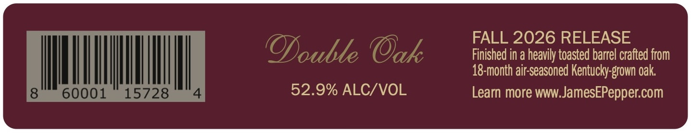

# TTB COLA Label Images - TTBID 26209001000055

**Brand Name:** JAMES E. PEPPER

**Fanciful Name:** DOUBLE OAK

**Issue Date:** 08/03/2026

**Origin Code:** 22

**Product Class/Type:** 101

**Source:** [TTB Public COLA Registry](https://ttbonline.gov/colasonline/viewColaDetails.do?action=publicFormDisplay&ttbid=26209001000055)

## Label Images

### Back Label

### Label 1

## Extracted Label Text

*Text extracted via OCR - may contain errors*

**Detected Proof:** 105.8

### Back Label

FALL 2026 RELEASE
Ooulle Oak
Finished in a heavily toasted barrel crafted from
18-month air-seasoned Kentucky-grown oak
60001
15728
52.9% ALC/VOL
Learn more WWW;_
JamesEPepper com

### Label 1

EST'D
1880
JAMES E. PEPPER
KENTUCKY STRAIGHT BOURBON
WHISKEY
AT
JAMES E PEPPER
DISTILLED E
LEXINGTON,
THE
DIStILLERK
HISTORIC
