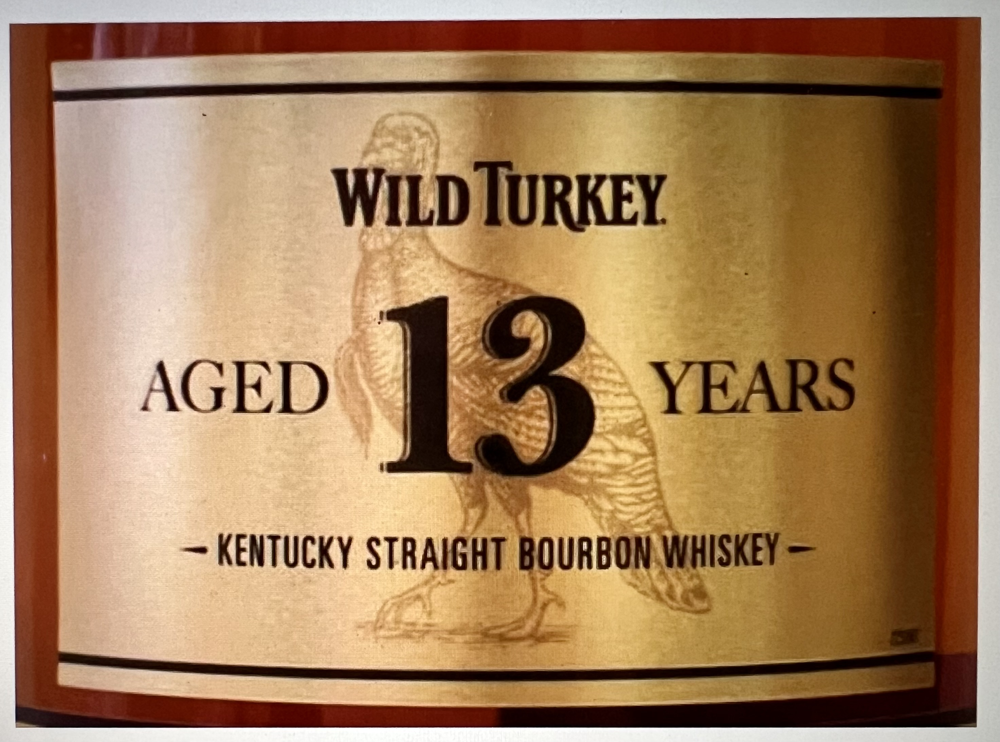
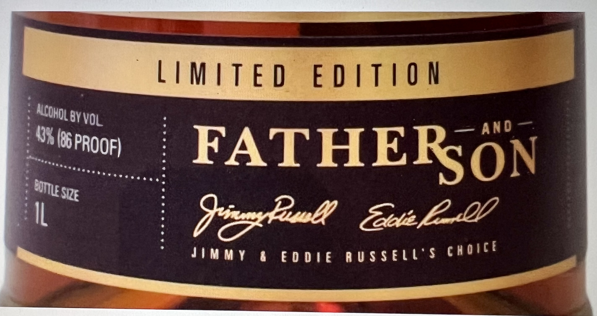
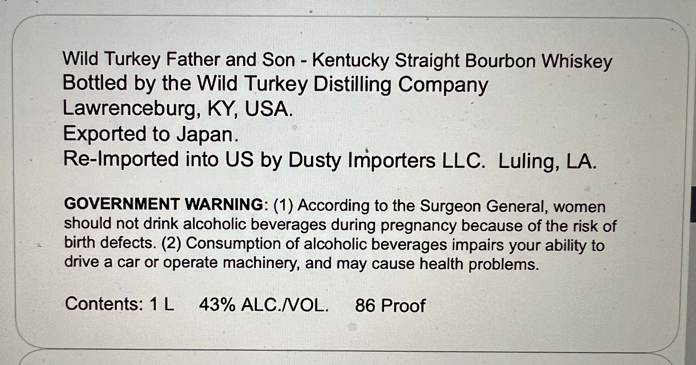

# TTB COLA Label Images - TTBID 26209001000073

**Brand Name:** WILD TURKEY

**Issue Date:** 08/03/2026

**Origin Code:** 00

**Product Class/Type:** 101

**Source:** [TTB Public COLA Registry](https://ttbonline.gov/colasonline/viewColaDetails.do?action=publicFormDisplay&ttbid=26209001000073)

## Label Images

### Label 1

### Label 2

### Label 3

## Extracted Label Text

*Text extracted via OCR - may contain errors*

*1 image(s) excluded: text did not meet readability threshold*

**Detected Proof:** 86
**Detected Age:** 13 Years

### Label 1

WILD TURKEY
AGED
13
YEARS
KENTUCKY  STRAIGHT BOURBON WHISKEY

### Label 3

Wild Turkey Father and Son
Kentucky Straight Bourbon Whiskey
Bottled by the Wild Turkey Distilling Company
Lawrenceburg, KY, USA
Exported to Japan.
Re-Imported into US by Dusty Importers LLC. Luling, LA
GOVERNMENT WARNING: (1) According to the Surgeon General,
women
should not drink alcoholic beverages during pregnancy because of the risk of
birth defects. (2) Consumption of alcoholic beverages impairs your ability to
drive a car Or
operate machinery, and may cause health problems.
Contents: 1 L
43% ALC.NOL.
86 Proof
