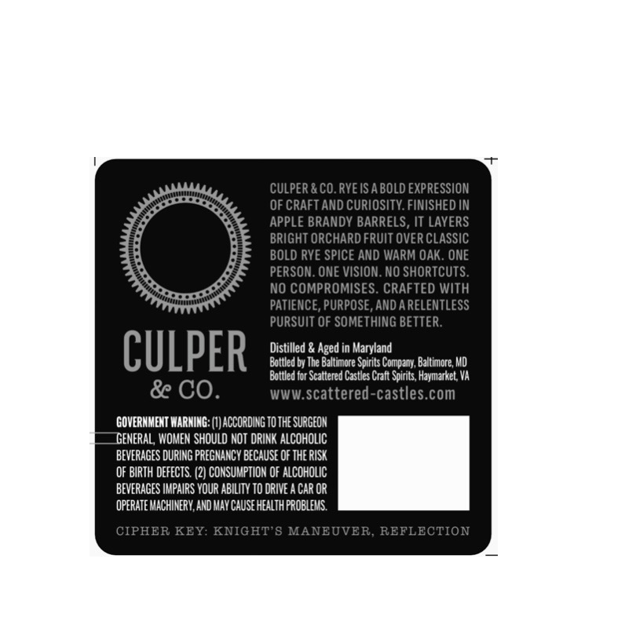
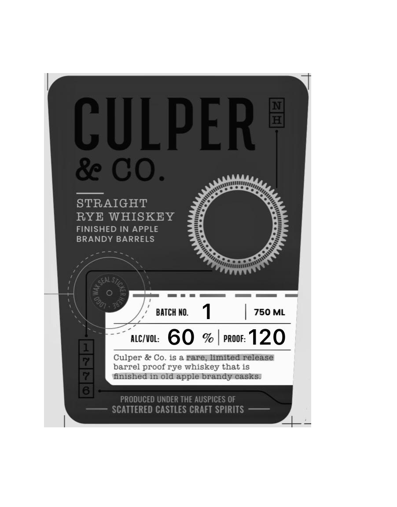
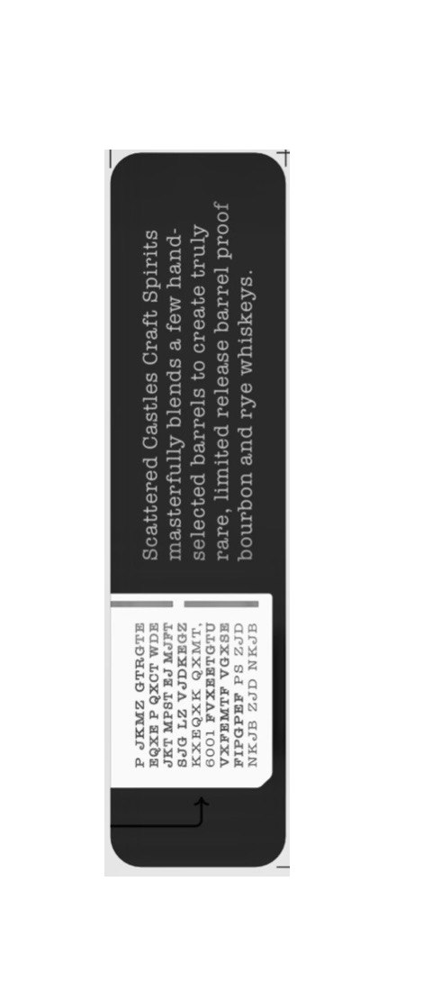

# TTB COLA Label Images - TTBID 26209001000115

**Brand Name:** CULPER & CO.

**Issue Date:** 08/03/2026

**Origin Code:** 25

**Product Class/Type:** 102

**Source:** [TTB Public COLA Registry](https://ttbonline.gov/colasonline/viewColaDetails.do?action=publicFormDisplay&ttbid=26209001000115)

## Label Images

### Back Label

### Front Label

### Label 3

## Extracted Label Text

*Text extracted via OCR - may contain errors*

**Detected Proof:** 120

### Back Label

CULPER & CO.RYE ISA BOLD EXPRESSION
OF CRAFT AND CURIOSITY. FINISHED IN
APPLE BRANDY BARRELS, IT LAYERS
BRIGHT ORCHARD FRUIT OVER CLASSIC
BOLD RYE SPICE AND WARM OAK . ONE
PERSON. ONE VISION. NO SHORTCUTS.
NO COMPROMISES. CRAFTED WITh
PATIENCE, PURPOSE, AND A RELENTLESS
PURSUIT OF SOMETHING BETTER:
CULPER
Distilled & Aged in Maryland
Bottled by The Baltimore Spirits Company, Baltimore; MD
Bottled for Scattered Castles Craft Spirits, Haymarket VA
& CO
WWW.scattered-castles.com
GOVERNMENT WARNING
LACCORDING TO THE SURGEOH
GENERAL, WOMEN SHOULD NOT DRINK ALCoHOLIC
BEVERAGES DURING PREGNANCY BECAUSE OF THE RISK
OF BIRTH defEctS (2) CONSUMPTION OF ALCOHOLIC
BEVERAGES IMPAIRS YOUR ABILITY TO dRIVE
CAR OR
OPERATE MACHINERY,AND MAY CauSe HEALTH PROBLEMS
CIPHER KEY: KNIGHT'8 MANEUVER
REFLECTION

### Front Label

CULPER
8 CO.
STRAIGHT
RYE WHISKEY
FINISHED IN APPLE
BRANDY BARRELS
BATCH NO.
750 ML
ALCIVOL:
60
%
PROOF:
120
Culper & Co
is & rare,limited release
barrel proof rye whiskey that is
finished in old apple brandy casks:
PRODUCED UNDER THE AUSPICES OF
SCATTERED CASTLES CRAFT SPIRITS
'0901

### Label 3

ICUN GCZ aCUN
1eZ Sd ded Oda
ISXOA ALNGIXA
OLOLEEXAA 1009

LNXO MXOaXH
ZOaMALA 21 Ors
Lach Pa isdn Lue
aM LOxd d axda
GLOULD ZWur 4
