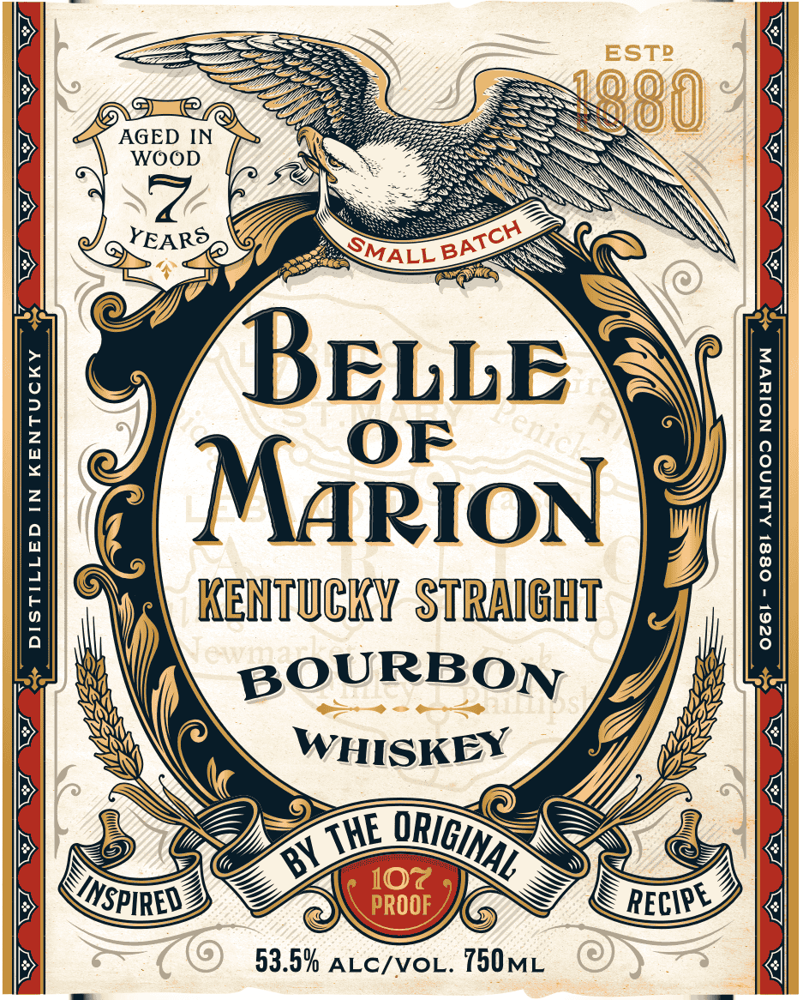
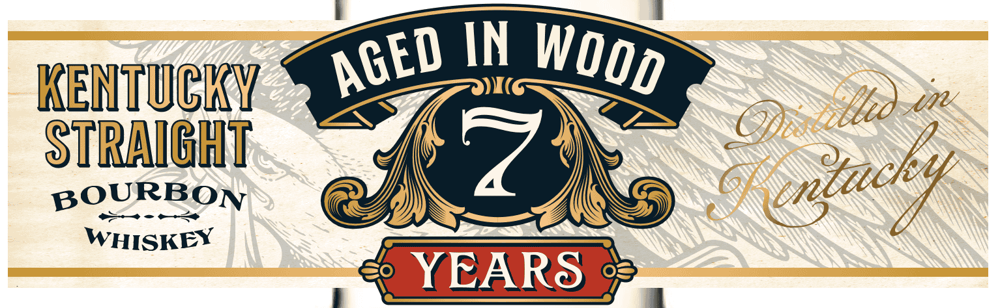
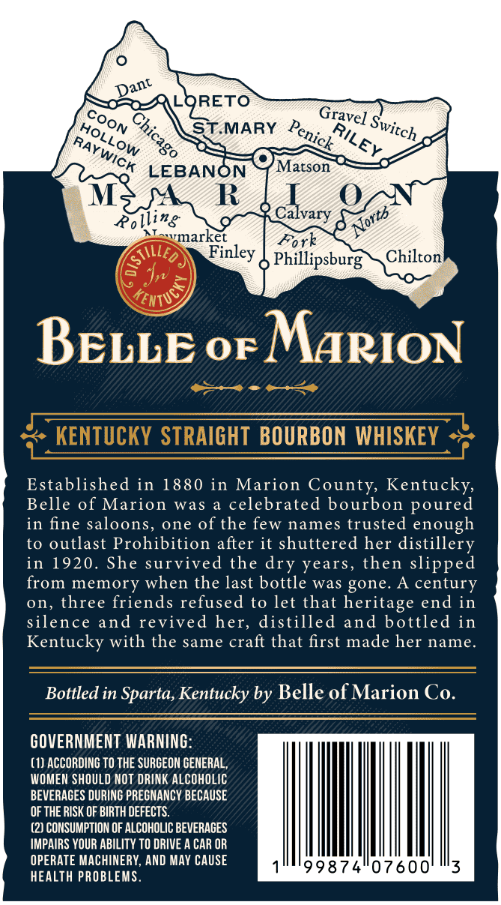

# TTB COLA Label Images - TTBID 26209001000295

**Brand Name:** BELLE OF MARION

**Issue Date:** 09/09/2026

**Origin Code:** 22

**Product Class/Type:** 101

**Source:** [TTB Public COLA Registry](https://ttbonline.gov/colasonline/viewColaDetails.do?action=publicFormDisplay&ttbid=26209001000295)

## Label Images

### Label 1

### Label 2

### Label 3

## Extracted Label Text

*Text extracted via OCR - may contain errors*

**Detected Proof:** 107

### Label 1

ESTR
080
AGED IN
WOOD
YEARS _
1
BELLE

OF
2
MARION
1
3
1
KENTuCKY Straicht
8
Aa
BOURBON
WHISKEY
6Y
107
PROOF
53.59 ALc/voL. 750ML
BATCH
SMALL
er _
THE
ORIGINAL
INSPIRED
RECIPE

### Label 2

IN
KENTUCKY
STRAICHT
BOURBON
WHISKEY
YEARS
WOOd
AGED
GAEec
i
(enzacky

### Label 3

LORETO
STMARY
LEBANON
Matson
M
R
Roling
Calvary
"rmarket
Fork
Phillipsburg
Chilton
KentuS
BELLE 0F MARION
kenTucKY STRAIGHT BOURBON WHISKEY
Established in 1880 in Marion County Kentucky,
Belle of Marion
was
celebrated bourbon poured
in fine saloons,
one
of the few names trusted enough
to outlast Prohibition after it shuttered her
distillery
in 1920. She survived the
years, then slipped
from memory when the last bottle was gone.
century
0n, three friends refused to let that heritage end in
silence and revived her, distilled and bottled in
Kentucky with the same craft that first made her name_
Bottled in Sparta, Kentucky by Belle of Marion Co.
GOVERNMENT WARNING:
(1) ACCORDING TO THE SURCEON GENERAL,
WOMEN SHOULD NOT DRINK ALCOHOLIC
BEVERAGES DURING PREGNANCY BECAUSE
OF THE RISK OF BIRTH DEFECTS.
(2) CONSUMPTION OF ALCOHOLIC BEVERAGES
IMPAIRS YOUR ABILITY TO DRIVE A CAR OR
OPERATE MACHINERY; AND MAY CAUSE
99874"07600'
3
HEALTH PROBLEMS
Dant
Gravel
COON
0
Switch
Penick_
HOLLOW
RILEY
RAYWICK
'Norts
Finley
Sulleo
dry
