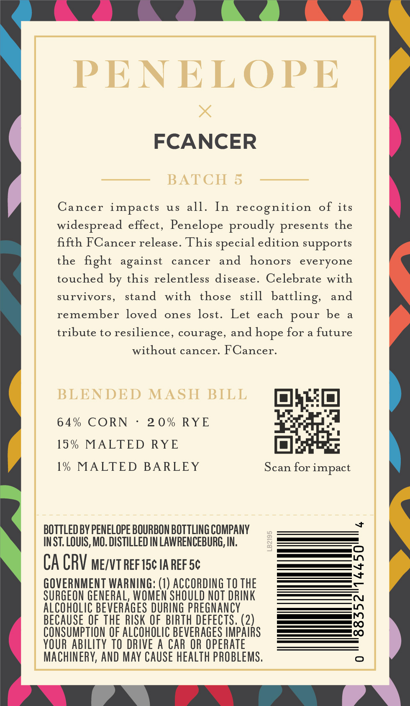
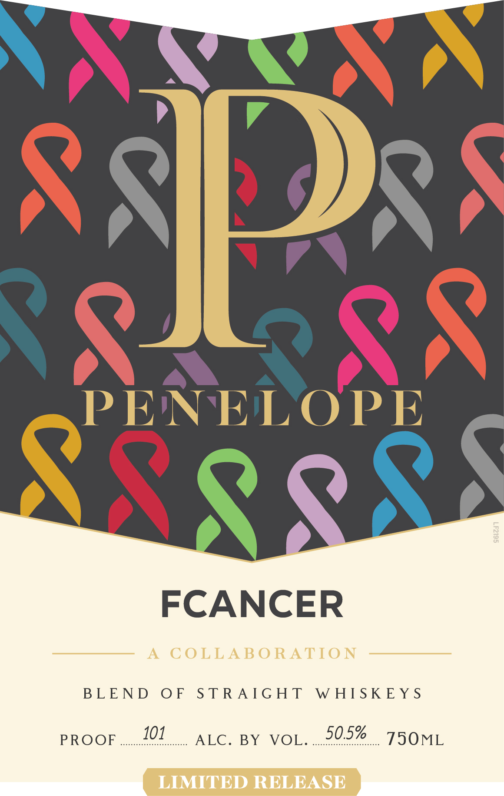

# TTB COLA Label Images - TTBID 26209001000297

**Brand Name:** PENELOPE

**Issue Date:** 08/12/2026

**Origin Code:** 29

**Product Class/Type:** 120

**Source:** [TTB Public COLA Registry](https://ttbonline.gov/colasonline/viewColaDetails.do?action=publicFormDisplay&ttbid=26209001000297)

## Label Images

### Back Label

### Front Label

## Extracted Label Text

*Text extracted via OCR - may contain errors*

**Detected Proof:** 128

### Back Label

PENELOPE
FCANCER
BATCH 5
Cancer impacts
uS
all.
In recognition
of
its
widespread effect, Penelope proudly presents the
fifth FCancer release. This special edition supports
the fight
cancer
and
honors
everyone
touched by this relentless disease_
Celebrate with
survivors,
stand
with
those
still
battling;
and
remember loved
ones
Let
each pour
be
tribute to resilience, courage, and
for
future
without cancer: FCancer.
BLENDED MASH BILL
64 %
CORN
2 0 % RYE
15 %
MALTED RYE
1% MALTED
BARLEY
Scan for impact

BOTTLEDBY PENELOPE BOURBON BOTTLING COMPANY
INST: LOUIS, MO. DISTILLED IN LAWRENCEBURG, IN:
8
CA CRV ME/VT REFISc IA REFSc
;
GOVERNMENT WARNING: (1) ACCORDING TO THE
SURGEON GENERAL, WOMEN SHOULD NOT DRINK
ALCOHOLIC BEVERAGES DURING pREGNANCY
BECAUSE OF THE RISK QF   BIRTH DEFECTS. (2)
3
CONSUMPTION OF ALCOHOLIC BEVERAGES HMPAIRS
YOUR AbILITY TO DRIVE A CAR OR OPERATE
MAChINERY, AND May CAUSE healTh PROBLEMS:
against
lost.
hope

### Front Label

FCANCER

A COLLABORATION

BEEN DEO EPS TRANG HDS WEIS IIE Ys

AEG saB YaViO lr 50.5% a 7SOML

LIMITED RELEASE
