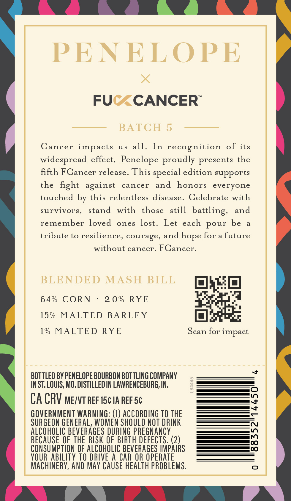
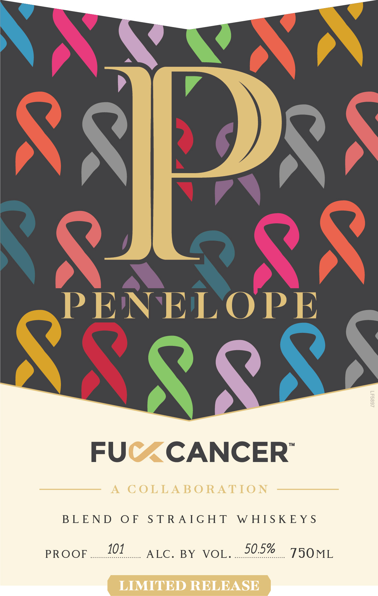
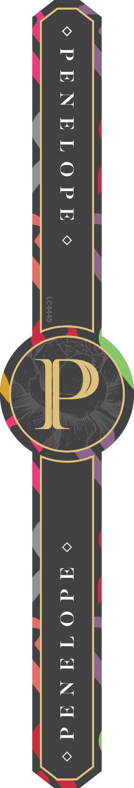

# TTB COLA Label Images - TTBID 26209001000307

**Brand Name:** PENELOPE

**Issue Date:** 08/10/2026

**Origin Code:** 19

**Product Class/Type:** 120

**Source:** [TTB Public COLA Registry](https://ttbonline.gov/colasonline/viewColaDetails.do?action=publicFormDisplay&ttbid=26209001000307)

## Label Images

### Back Label

### Label 1

### Label 2

## Extracted Label Text

*Text extracted via OCR - may contain errors*

*1 image(s) excluded: text did not meet readability threshold*

### Back Label

PENELOPE
FUC
CANCER"
BATCH 5
Cancer impacts
uS
all.
In recognition
of
its
widespread effect, Penelope proudly presents the
fifth FCancer release. This special edition supports
the
fight
cancer
and
honors
everyone
touched by this relentless disease.
Celebrate with
survivors,
stand
with
those
still
battling,
and
remember
loved
ones
Let
each pour be
tribute to resilience, courage, and
for
future
without cancer. FCancer_
BLENDED
MASH BILL
6 4 %
CORN
2 0% RYE
15 %
MALTED
BARLEY
1% MALTED RYE
Scan for impact
J
BOTTLED BY PENELOPE BOURBON BOTTLING COMPANY
INST: LOUIS, MO. DISTILLED IN LAWRENCEBURG, IN:
1
CA CRV Me/VT REF I5c IA REFSc
8
GOVERNMENT WARNING: (1) ACCORDING TO THE
SURGEON GENERAL, WOMEN SHOULD NOT DRINK
ALCOHOLIC BEVERAGES DURING pREGNANCY
E
BECAUSE OFTHE RISK OF BIRTH DEFECTS. (2)
CONSUMPTION OF ALCOHOLIC BEVERAGES IMPAIRS
YOUR   ABILITY TO DRIVE A CAR OR OPERATE
MAChINeRY, AND MAy CAUSE HEALTH PROBLEMS:
against
lost .
hope

### Label 1

\

-_ =

s

x

FUC<CANCER

A COLLABORATION

BEEINDVOE TS TRANG HIS Ww EIS ik E YS

PROOE

101

AEE BY VOL. ...29.5% ee

TSOML

LIMITED RELEASE
