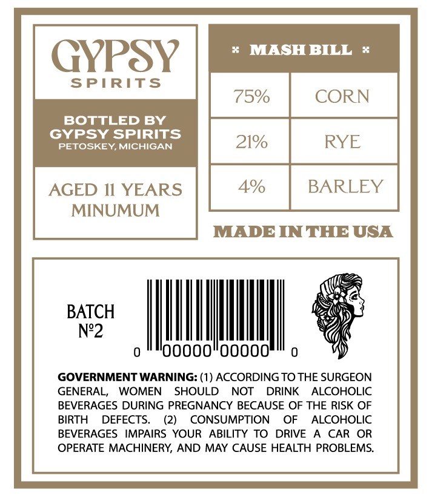
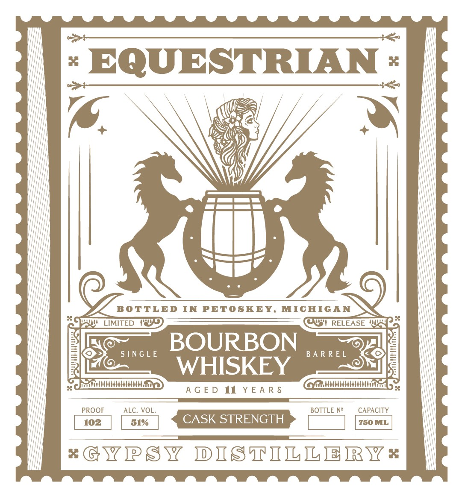

# TTB COLA Label Images - TTBID 26209001000317

**Brand Name:** EQUESTRIAN

**Issue Date:** 08/04/2026

**Origin Code:** 06

**Product Class/Type:** 141

**Source:** [TTB Public COLA Registry](https://ttbonline.gov/colasonline/viewColaDetails.do?action=publicFormDisplay&ttbid=26209001000317)

## Label Images

### Back Label

### Front Label

## Extracted Label Text

*Text extracted via OCR - may contain errors*

### Back Label

GYPSY | litem
SPIRITS
75% CORN
BOTTLED BY
GYPSY SPIRITS
cial idieaiiadiid
AGED Il YEARS BARLEY
MINUMUM
MADE IN THE USA
veg
BATCH ayy
N°2 Gi
o""o0000"00000""5
GOVERNMENT WARNING: (1) ACCORDING TO THE SURGEON
GENERAL, WOMEN SHOULD NOT DRINK ALCOHOLIC
BEVERAGES DURING PREGNANCY BECAUSE OF THE RISK OF
BIRTH DEFECTS. (2) CONSUMPTION OF ALCOHOLIC
BEVERAGES IMPAIRS YOUR ABILITY TO DRIVE A CAR OR
OPERATE MACHINERY, AND MAY CAUSE HEALTH PROBLEMS.

### Front Label

" EQUESTRIAN -

ry

BOURBON

Pou! LimiTeD 1) AST RELEASE Wed
NS ce ret ce
pon’ WHISKEY =

Pez ical MOR) Gc AMMMMNMNM nin 4

AGED if YEARS

OO —_—eeoeeeE I —————
PROOF “ALC.VOl. BOTTLE N° CAPACITY
102 51% CASK STRENGTH wibiai
a
GYPSY DISTILLER Ws
